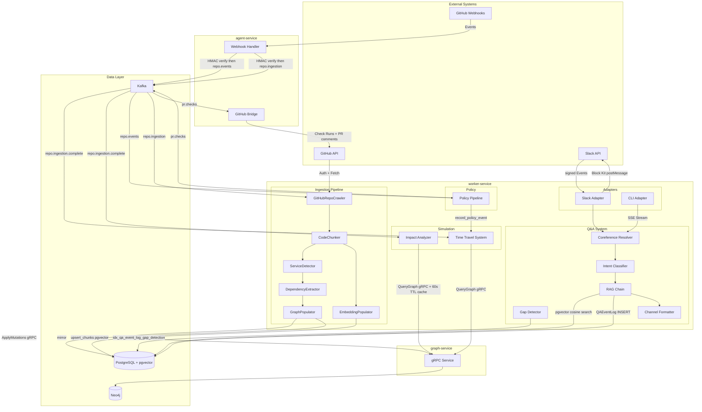
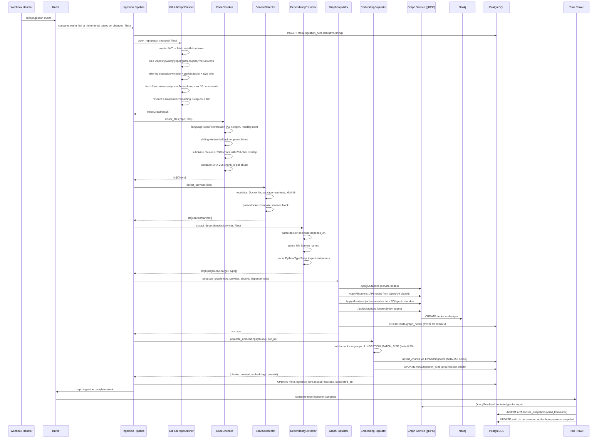
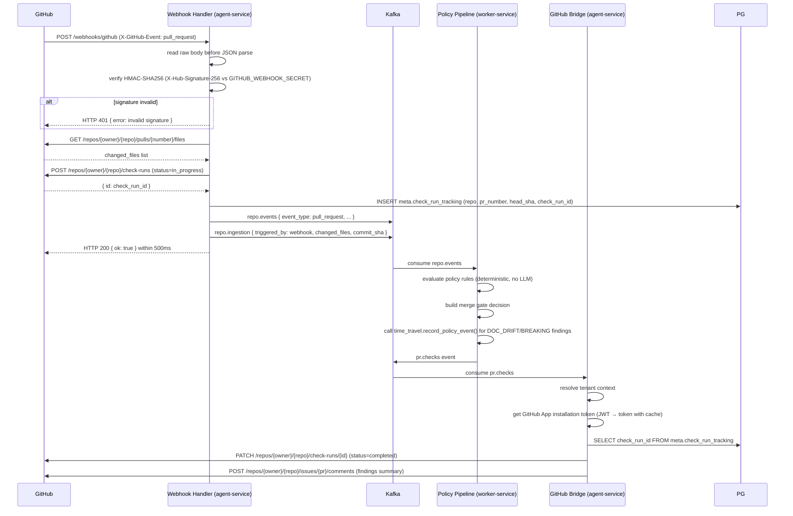
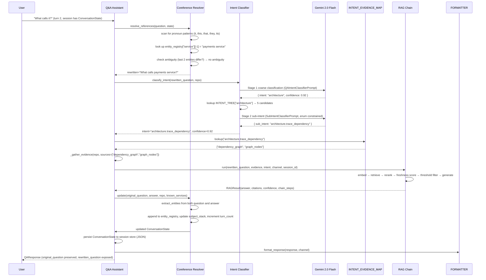

I've read the entire document carefully — all 3500+ lines. Here is the improved version with every gap filled, every vague section sharpened, missing components added, and formatting preserved exactly as you gave it:

---

# Design Document: KA-CHOW Production Completion

## Overview

This design completes the KA-CHOW AI-powered engineering brain platform by closing 4 critical gaps and applying 5 targeted improvements. The platform is currently 80% complete with working LLM core (Gemini 2.0 Flash), RAG pipeline, architecture planner, scaffolder, impact analyzer, time travel system, autofix engine, onboarding engine, and policy pipeline.

The design integrates new components with existing infrastructure without rewriting working code. All new modules follow the established patterns in worker-service/app/ and agent-service/app/.

**Critical Gaps Closed:**
1. GitHub Repository Ingestion Pipeline — End-to-end ingestion from GitHub to Neo4j and pgvector
2. Neo4j Graph Service Integration — Wire Impact Analyzer to real Neo4j data via gRPC
3. Temporal Graph Data Population — Capture architecture snapshots after every ingestion
4. GitHub Webhook for Automatic CI Triggering — Automatic policy checks on PR events

**Improvements Applied:**
1. Hierarchical Intent Classification — Two-stage LLM classification (coarse → sub-intent)
2. Coreference Resolution — Resolve pronouns in multi-turn conversations
3. Always-On Reranking with Freshness — Prioritize recent content with freshness scoring
4. Documentation Gap Detection — Mine QA logs to identify documentation gaps
5. Channel-Aware Response Formatting — Format responses for Slack, CLI, web, API

**Technology Stack:**
- Python 3.12, FastAPI
- Google Gemini 2.0 Flash (LLM), text-embedding-004 (embeddings, 768 dimensions)
- PostgreSQL 15+ with pgvector extension, HNSW index (m=16, ef_construction=64)
- Neo4j 5+ graph database
- Apache Kafka for event streaming
- gRPC for graph service communication
- GitHub API with GitHub App authentication (JWT → installation token)

---

## Architecture

### High-Level System Architecture



---

### Ingestion Pipeline Flow



---

### Webhook to Policy Check Flow



---

### Hierarchical Intent Classification Flow



---

## Components and Interfaces

### 1. GitHub Repository Ingestion Pipeline

#### GitHubRepoCrawler (worker-service/app/ingestion/crawler.py)

**Purpose:** Authenticate with GitHub App credentials, fetch repository file tree, and retrieve raw file content with rate limit awareness and bounded concurrency.

**Class Structure:**
```python
@dataclass
class FileContent:
    path: str
    content: str
    extension: str
    size_bytes: int
    sha: str
    last_modified: datetime | None  # from commits API, used for freshness scoring

@dataclass
class RepoCrawlResult:
    repo: str
    default_branch: str
    total_files: int
    files: list[FileContent]
    crawled_at: datetime

class GitHubRepoCrawler:
    EXTENSION_WHITELIST = {
        ".py", ".ts", ".js", ".go", ".java",
        ".yaml", ".yml", ".json", ".md", ".proto", ".tf", ".sql"
    }
    PATH_BLACKLIST = {
        "node_modules/", ".git/", "dist/", "build/",
        "__pycache__/", "vendor/", "coverage/", ".next/", ".nuxt/"
    }

    def __init__(self, app_id: str, private_key: str, installation_id: str,
                 max_concurrent: int = 10, max_file_size_kb: int = 500):
        self.app_id = app_id
        self.private_key = private_key
        self.installation_id = installation_id
        self.max_file_size_bytes = max_file_size_kb * 1024
        self._token_cache: dict[str, tuple[str, datetime]] = {}  # token → (value, expiry)
        self._rate_limit_remaining: int = 5000
        self._rate_limit_reset: datetime | None = None
        self._semaphore = asyncio.Semaphore(max_concurrent)

    async def crawl_repo(self, repo: str,
                         changed_files: list[str] | None = None) -> RepoCrawlResult:
        """Full or incremental crawl. If changed_files provided, only fetch those."""
        token = await self._get_installation_token()
        default_branch = await self._get_default_branch(repo, token)
        tree_sha = await self._get_branch_sha(repo, default_branch, token)

        if changed_files is not None:
            # Incremental: only fetch listed files
            file_items = [{"path": f, "type": "blob"} for f in changed_files]
        else:
            # Full: walk entire tree
            file_items = await self._fetch_tree(repo, tree_sha, token)

        filtered = [f for f in file_items if self._should_include_file(f["path"], 0)]
        files = await asyncio.gather(*[
            self._fetch_file_content(repo, f["path"], token)
            for f in filtered
        ])
        files = [f for f in files if f is not None]  # drop fetch failures

        return RepoCrawlResult(
            repo=repo,
            default_branch=default_branch,
            total_files=len(files),
            files=files,
            crawled_at=datetime.now(timezone.utc),
        )

    def _create_jwt(self) -> str:
        """Create GitHub App JWT. Valid for 10 minutes, used to get installation token."""
        now = int(time.time())
        payload = {"iat": now - 60, "exp": now + 540, "iss": self.app_id}
        return jwt.encode(payload, self.private_key, algorithm="RS256")

    async def _get_installation_token(self) -> str:
        """Get cached installation token or fetch a new one. Refreshes 1 minute before expiry."""
        cached_token, expiry = self._token_cache.get("default", (None, None))
        if cached_token and expiry and datetime.now(timezone.utc) < expiry - timedelta(minutes=1):
            return cached_token
        app_jwt = self._create_jwt()
        async with httpx.AsyncClient() as client:
            resp = await client.post(
                f"https://api.github.com/app/installations/{self.installation_id}/access_tokens",
                headers={"Authorization": f"Bearer {app_jwt}",
                         "Accept": "application/vnd.github+json"},
            )
            resp.raise_for_status()
            data = resp.json()
            token = data["token"]
            expiry = datetime.fromisoformat(data["expires_at"].replace("Z", "+00:00"))
            self._token_cache["default"] = (token, expiry)
            return token

    async def _fetch_tree(self, repo: str, sha: str, token: str) -> list[dict]:
        """Fetch full repository file tree recursively."""
        async with httpx.AsyncClient() as client:
            resp = await client.get(
                f"https://api.github.com/repos/{repo}/git/trees/{sha}?recursive=1",
                headers={"Authorization": f"Bearer {token}",
                         "Accept": "application/vnd.github+json"},
            )
            await self._handle_rate_limit(resp)
            resp.raise_for_status()
            data = resp.json()
            return [item for item in data.get("tree", []) if item["type"] == "blob"]

    async def _fetch_file_content(self, repo: str, path: str,
                                   token: str) -> FileContent | None:
        """Fetch and decode single file. Returns None on 404 or size exceeded."""
        async with self._semaphore:
            for attempt in range(5):
                try:
                    async with httpx.AsyncClient() as client:
                        resp = await client.get(
                            f"https://api.github.com/repos/{repo}/contents/{path}",
                            headers={"Authorization": f"Bearer {token}",
                                     "Accept": "application/vnd.github+json"},
                        )
                        await self._handle_rate_limit(resp)
                        if resp.status_code == 404:
                            log.warning(f"File not found: {repo}/{path}")
                            return None
                        if resp.status_code == 429:
                            wait = 2 ** attempt
                            log.warning(f"Rate limited, sleeping {wait}s")
                            await asyncio.sleep(min(wait, 60))
                            continue
                        resp.raise_for_status()
                        data = resp.json()
                        size_bytes = data.get("size", 0)
                        if size_bytes > self.max_file_size_bytes:
                            log.debug(f"Skipping {path}: {size_bytes} bytes exceeds limit")
                            return None
                        content = base64.b64decode(data["content"]).decode("utf-8", errors="replace")
                        return FileContent(
                            path=path,
                            content=content,
                            extension=Path(path).suffix.lower(),
                            size_bytes=size_bytes,
                            sha=data["sha"],
                            last_modified=None,  # populated separately if needed
                        )
                except httpx.HTTPError as e:
                    log.warning(f"HTTP error fetching {path} (attempt {attempt+1}): {e}")
                    await asyncio.sleep(min(2 ** attempt, 60))
            return None

    def _should_include_file(self, path: str, size_bytes: int) -> bool:
        """Filter by extension whitelist, path blacklist, and size limit."""
        ext = Path(path).suffix.lower()
        if ext not in self.EXTENSION_WHITELIST:
            return False
        if any(pattern in path for pattern in self.PATH_BLACKLIST):
            return False
        if size_bytes > self.max_file_size_bytes:
            return False
        return True

    async def _handle_rate_limit(self, response: httpx.Response) -> None:
        """Read rate limit headers and sleep until reset if below 100 remaining."""
        remaining = int(response.headers.get("X-RateLimit-Remaining", 5000))
        reset_ts = int(response.headers.get("X-RateLimit-Reset", 0))
        self._rate_limit_remaining = remaining
        if remaining < 100 and reset_ts:
            sleep_seconds = max(0, reset_ts - int(time.time())) + 5
            log.warning(f"GitHub rate limit low ({remaining}), sleeping {sleep_seconds}s")
            await asyncio.sleep(sleep_seconds)
```

**Key Design Decisions:**
- JWT created fresh per installation token fetch; token cached with 1-minute safety margin before expiry
- asyncio Semaphore bounds concurrent GitHub API calls to INGESTION_MAX_CONCURRENT_FETCHES
- Exponential backoff for 429 responses: 2s → 4s → 8s → 16s → 32s → 60s cap, 5 attempts max
- Files exceeding INGESTION_MAX_FILE_SIZE_KB are skipped silently with debug log
- 404 on individual file fetch logs a warning and returns None — ingestion continues
- last_modified field populated from commits API only when freshness scoring is needed


#### CodeChunker (worker-service/app/ingestion/chunker.py)

**Purpose:** Transform raw file content into semantically meaningful, embeddable chunks using language-specific extraction strategies. Never truncates — always subdivides.

**Class Structure:**
```python
@dataclass
class Chunk:
    chunk_id: str          # SHA-256(repo + path + content)
    repo: str
    file_path: str
    extension: str
    content: str
    source_type: Literal["code", "docs", "spec", "config", "migration", "infra"]
    metadata: dict         # language-specific fields (function_name, http_method, etc.)
    start_line: int
    end_line: int
    char_count: int

class CodeChunker:
    def __init__(self, max_chunk_chars: int = 2000):
        self.max_chunk_chars = max_chunk_chars
        self._extractors: dict[str, Callable[[FileContent], list[Chunk]]] = {
            ".py":   self._extract_python,
            ".ts":   self._extract_typescript,
            ".js":   self._extract_javascript,
            ".go":   self._extract_go,
            ".md":   self._extract_markdown,
            ".yaml": self._extract_yaml,
            ".yml":  self._extract_yaml,
            ".json": self._extract_json,
            ".proto": self._extract_proto,
            ".sql":  self._extract_sql,
            ".tf":   self._extract_terraform,
        }

    def chunk_files(self, repo: str, files: list[FileContent]) -> list[Chunk]:
        """Chunk all files using language-specific strategies. Falls back to sliding window."""
        all_chunks = []
        for file in files:
            extractor = self._extractors.get(file.extension, self._sliding_window)
            try:
                chunks = extractor(file)
            except Exception as e:
                log.warning(f"Extractor failed for {file.path}: {e}, using sliding window")
                chunks = self._sliding_window(file)
            # Subdivide oversized chunks
            final_chunks = []
            for chunk in chunks:
                if chunk.char_count > self.max_chunk_chars:
                    final_chunks.extend(self._subdivide_large_chunk(chunk))
                else:
                    final_chunks.append(chunk)
            # Assign repo-scoped chunk_ids
            for chunk in final_chunks:
                chunk.repo = repo
                chunk.chunk_id = self._compute_chunk_id(repo, chunk.file_path, chunk.content)
            all_chunks.extend(final_chunks)
        return all_chunks

    def _extract_python(self, file: FileContent) -> list[Chunk]:
        """Extract top-level functions and classes using AST. Falls back to sliding window."""
        try:
            tree = ast.parse(file.content)
        except SyntaxError:
            return self._sliding_window(file)
        chunks = []
        lines = file.content.splitlines()
        for node in ast.walk(tree):
            if not isinstance(node, (ast.FunctionDef, ast.AsyncFunctionDef, ast.ClassDef)):
                continue
            if not isinstance(node.col_offset == 0, bool) or node.col_offset != 0:
                continue  # only top-level
            start = node.lineno - 1
            end = node.end_lineno
            content = "\n".join(lines[start:end])
            docstring = ast.get_docstring(node) or ""
            chunks.append(Chunk(
                chunk_id="",  # filled later
                repo="",
                file_path=file.path,
                extension=file.extension,
                content=content,
                source_type="code",
                metadata={
                    "name": node.name,
                    "type": "function" if isinstance(node, (ast.FunctionDef, ast.AsyncFunctionDef)) else "class",
                    "docstring": docstring[:200],
                    "start_line": node.lineno,
                    "end_line": node.end_lineno,
                },
                start_line=node.lineno,
                end_line=node.end_lineno,
                char_count=len(content),
            ))
        return chunks if chunks else self._sliding_window(file)

    def _extract_typescript(self, file: FileContent) -> list[Chunk]:
        """Extract declarations using regex with 30-line context windows."""
        pattern = re.compile(
            r'(?:export\s+)?(?:async\s+)?(?:function|class|interface|type|const)\s+(\w+)'
        )
        lines = file.content.splitlines()
        chunks = []
        for match in pattern.finditer(file.content):
            line_num = file.content[:match.start()].count('\n')
            start = max(0, line_num - 2)
            end = min(len(lines), line_num + 30)
            content = "\n".join(lines[start:end])
            chunks.append(Chunk(
                chunk_id="", repo="", file_path=file.path, extension=file.extension,
                content=content, source_type="code",
                metadata={"name": match.group(1), "declaration_type": match.group(0).split()[0]},
                start_line=start + 1, end_line=end, char_count=len(content),
            ))
        return chunks if chunks else self._sliding_window(file)

    def _extract_javascript(self, file: FileContent) -> list[Chunk]:
        """Same pattern as TypeScript."""
        return self._extract_typescript(file)

    def _extract_go(self, file: FileContent) -> list[Chunk]:
        """Extract func declarations and struct/interface types."""
        func_pattern = re.compile(r'func\s+(?:\(([^)]+)\)\s+)?(\w+)\s*\(')
        type_pattern = re.compile(r'type\s+(\w+)\s+(?:struct|interface)')
        lines = file.content.splitlines()
        chunks = []
        for match in list(func_pattern.finditer(file.content)) + list(type_pattern.finditer(file.content)):
            line_num = file.content[:match.start()].count('\n')
            start = max(0, line_num)
            end = min(len(lines), line_num + 40)
            content = "\n".join(lines[start:end])
            receiver = match.group(1) if func_pattern.match(match.group(0)) else None
            chunks.append(Chunk(
                chunk_id="", repo="", file_path=file.path, extension=file.extension,
                content=content, source_type="code",
                metadata={"name": match.group(2) if receiver is not None else match.group(1),
                          "receiver_type": receiver},
                start_line=start + 1, end_line=end, char_count=len(content),
            ))
        return chunks if chunks else self._sliding_window(file)

    def _extract_markdown(self, file: FileContent) -> list[Chunk]:
        """Split on ## and ### headings. Each section is one chunk."""
        sections = re.split(r'\n(?=#{2,3}\s)', file.content)
        chunks = []
        line_offset = 0
        for section in sections:
            if not section.strip():
                continue
            first_line = section.split('\n')[0]
            title = re.sub(r'^#+\s*', '', first_line).strip()
            line_count = section.count('\n') + 1
            chunks.append(Chunk(
                chunk_id="", repo="", file_path=file.path, extension=file.extension,
                content=section, source_type="docs",
                metadata={"section_title": title},
                start_line=line_offset + 1, end_line=line_offset + line_count,
                char_count=len(section),
            ))
            line_offset += line_count
        return chunks if chunks else self._sliding_window(file)

    def _extract_yaml(self, file: FileContent) -> list[Chunk]:
        """Handle OpenAPI specs, Kubernetes manifests, and generic YAML."""
        try:
            parsed = yaml.safe_load(file.content)
        except yaml.YAMLError:
            return self._sliding_window(file)
        if not isinstance(parsed, dict):
            return self._sliding_window(file)

        # OpenAPI spec
        if "openapi" in parsed or "swagger" in parsed:
            chunks = []
            paths = parsed.get("paths", {})
            for path, path_item in paths.items():
                for method, operation in path_item.items():
                    if method not in {"get", "post", "put", "patch", "delete", "options", "head"}:
                        continue
                    content = yaml.dump({path: {method: operation}})
                    chunks.append(Chunk(
                        chunk_id="", repo="", file_path=file.path, extension=file.extension,
                        content=content, source_type="spec",
                        metadata={
                            "http_method": method.upper(),
                            "path": path,
                            "operation_id": operation.get("operationId", ""),
                            "tags": operation.get("tags", []),
                            "deprecated": operation.get("deprecated", False),
                        },
                        start_line=1, end_line=content.count('\n') + 1,
                        char_count=len(content),
                    ))
            return chunks if chunks else self._sliding_window(file)

        # Kubernetes manifest
        if "kind" in parsed and "apiVersion" in parsed:
            return [Chunk(
                chunk_id="", repo="", file_path=file.path, extension=file.extension,
                content=file.content, source_type="config",
                metadata={"kind": parsed.get("kind"), "name": parsed.get("metadata", {}).get("name")},
                start_line=1, end_line=file.content.count('\n') + 1,
                char_count=len(file.content),
            )]

        # Generic YAML — whole file as one chunk
        return [Chunk(
            chunk_id="", repo="", file_path=file.path, extension=file.extension,
            content=file.content, source_type="config",
            metadata={}, start_line=1,
            end_line=file.content.count('\n') + 1, char_count=len(file.content),
        )]

    def _extract_json(self, file: FileContent) -> list[Chunk]:
        """Detect OpenAPI in JSON; otherwise whole file as one chunk."""
        try:
            parsed = json.loads(file.content)
            if isinstance(parsed, dict) and ("openapi" in parsed or "swagger" in parsed):
                # Convert to YAML string and reuse YAML extractor
                as_yaml = yaml.dump(parsed)
                fake_file = FileContent(
                    path=file.path, content=as_yaml, extension=".yaml",
                    size_bytes=len(as_yaml), sha=file.sha, last_modified=file.last_modified,
                )
                return self._extract_yaml(fake_file)
        except json.JSONDecodeError:
            pass
        return [Chunk(
            chunk_id="", repo="", file_path=file.path, extension=file.extension,
            content=file.content, source_type="config",
            metadata={}, start_line=1,
            end_line=file.content.count('\n') + 1, char_count=len(file.content),
        )]

    def _extract_proto(self, file: FileContent) -> list[Chunk]:
        """Extract service and message definitions from proto files."""
        service_pattern = re.compile(r'service\s+(\w+)\s*\{([^}]+)\}', re.DOTALL)
        message_pattern = re.compile(r'message\s+(\w+)\s*\{([^}]+)\}', re.DOTALL)
        chunks = []
        for match in list(service_pattern.finditer(file.content)) + list(message_pattern.finditer(file.content)):
            content = match.group(0)
            line_start = file.content[:match.start()].count('\n') + 1
            is_service = match.group(0).startswith("service")
            chunks.append(Chunk(
                chunk_id="", repo="", file_path=file.path, extension=file.extension,
                content=content, source_type="spec",
                metadata={"proto_type": "service" if is_service else "message",
                          "name": match.group(1)},
                start_line=line_start,
                end_line=line_start + content.count('\n'),
                char_count=len(content),
            ))
        return chunks if chunks else self._sliding_window(file)

    def _extract_sql(self, file: FileContent) -> list[Chunk]:
        """Extract CREATE TABLE, CREATE INDEX, CREATE FUNCTION statements."""
        pattern = re.compile(
            r'(CREATE\s+(?:TABLE|INDEX|UNIQUE\s+INDEX|FUNCTION|OR\s+REPLACE\s+FUNCTION)'
            r'\s+[^;]+;)',
            re.IGNORECASE | re.DOTALL
        )
        chunks = []
        for match in pattern.finditer(file.content):
            content = match.group(0).strip()
            line_start = file.content[:match.start()].count('\n') + 1
            # Extract object name
            name_match = re.search(r'(?:TABLE|INDEX|FUNCTION)\s+(?:IF\s+NOT\s+EXISTS\s+)?(\S+)', content, re.IGNORECASE)
            object_name = name_match.group(1) if name_match else ""
            stmt_type_match = re.match(r'CREATE\s+(\w+)', content, re.IGNORECASE)
            chunks.append(Chunk(
                chunk_id="", repo="", file_path=file.path, extension=file.extension,
                content=content, source_type="migration",
                metadata={"statement_type": stmt_type_match.group(1).upper() if stmt_type_match else "CREATE",
                          "object_name": object_name},
                start_line=line_start,
                end_line=line_start + content.count('\n'),
                char_count=len(content),
            ))
        return chunks if chunks else self._sliding_window(file)

    def _extract_terraform(self, file: FileContent) -> list[Chunk]:
        """Extract resource blocks from Terraform files."""
        pattern = re.compile(r'resource\s+"([^"]+)"\s+"([^"]+)"\s*\{([^}]+)\}', re.DOTALL)
        chunks = []
        for match in pattern.finditer(file.content):
            content = match.group(0)
            line_start = file.content[:match.start()].count('\n') + 1
            chunks.append(Chunk(
                chunk_id="", repo="", file_path=file.path, extension=file.extension,
                content=content, source_type="infra",
                metadata={"resource_type": match.group(1), "resource_name": match.group(2)},
                start_line=line_start,
                end_line=line_start + content.count('\n'),
                char_count=len(content),
            ))
        return chunks if chunks else self._sliding_window(file)

    def _sliding_window(self, file: FileContent,
                        window_lines: int = 50, overlap_lines: int = 10) -> list[Chunk]:
        """Fallback: fixed sliding window with overlap. Used for unknown types and parse failures."""
        lines = file.content.splitlines()
        chunks = []
        step = window_lines - overlap_lines
        for i in range(0, max(1, len(lines)), step):
            window = lines[i: i + window_lines]
            content = "\n".join(window)
            chunks.append(Chunk(
                chunk_id="", repo="", file_path=file.path, extension=file.extension,
                content=content,
                source_type="code" if file.extension in {".py", ".ts", ".js", ".go", ".java"} else "config",
                metadata={},
                start_line=i + 1, end_line=i + len(window), char_count=len(content),
            ))
        return chunks

    def _subdivide_large_chunk(self, chunk: Chunk) -> list[Chunk]:
        """Split oversized chunks with 200-char overlap. Never truncates."""
        sub_chunks = []
        content = chunk.content
        overlap = 200
        step = self.max_chunk_chars - overlap
        for i in range(0, len(content), step):
            sub_content = content[i: i + self.max_chunk_chars]
            sub_chunks.append(Chunk(
                chunk_id="", repo=chunk.repo, file_path=chunk.file_path,
                extension=chunk.extension, content=sub_content,
                source_type=chunk.source_type,
                metadata={**chunk.metadata, "sub_chunk_index": len(sub_chunks),
                          "original_start_line": chunk.start_line},
                start_line=chunk.start_line, end_line=chunk.end_line,
                char_count=len(sub_content),
            ))
        return sub_chunks

    def _compute_chunk_id(self, repo: str, path: str, content: str) -> str:
        """SHA-256 of repo+path+content for deterministic deduplication."""
        return hashlib.sha256(f"{repo}:{path}:{content}".encode()).hexdigest()
```

**Key Design Decisions:**
- Python: uses ast.walk() and filters by col_offset==0 for truly top-level nodes only
- TypeScript/JavaScript: shared extractor, regex-based with 30-line context
- Go: extracts both functions (with receiver type) and struct/interface types
- Markdown: re.split on heading boundaries; source_type="docs"
- OpenAPI YAML/JSON: path+method granularity, source_type="spec"
- Kubernetes YAML: entire manifest as one chunk, source_type="config"
- SQL: regex extracts DDL statements individually, source_type="migration"
- Terraform: resource block granularity, source_type="infra"
- Proto: service and message definitions, source_type="spec"
- Subdivides chunks >2000 chars with 200-char overlap — never truncates
- chunk_id is SHA-256(repo+path+content) — deterministic for deduplication


#### ServiceDetector & DependencyExtractor (worker-service/app/ingestion/service_detector.py)

**Purpose:** Identify microservice boundaries within a repository and extract inter-service dependencies from multiple sources.

**Class Structure:**
```python
@dataclass
class ServiceManifest:
    service_name: str
    root_path: str
    language: str          # dominant extension by file count
    has_dockerfile: bool
    has_openapi: bool      # any .yaml file containing "openapi:"
    has_proto: bool        # any .proto file present
    has_migrations: bool   # any .sql files or migrations/ directory
    has_tests: bool        # test_*.py, *.test.ts, *_test.go
    has_ci: bool           # .github/workflows/ directory
    owner_hint: str | None # from CODEOWNERS
    dependencies: list[str]
    endpoints: list[str]   # HTTP paths from OpenAPI specs
    file_paths: list[str]

class ServiceDetector:
    SERVICE_MARKERS = {"Dockerfile", "pyproject.toml", "package.json", "go.mod"}

    def detect_services(self, files: list[FileContent]) -> list[ServiceManifest]:
        """Identify service boundaries using heuristics across all detected markers."""
        # Build directory tree from file paths
        dirs: dict[str, list[FileContent]] = {}
        for file in files:
            dir_path = str(Path(file.path).parent)
            # Walk up to find root service dir (check top 2 levels only)
            top_level = file.path.split("/")[0] if "/" in file.path else "."
            dirs.setdefault(top_level, []).append(file)

        services = []
        for dir_path, dir_files in dirs.items():
            file_names = {Path(f.path).name for f in dir_files}
            has_marker = bool(self.SERVICE_MARKERS & file_names)
            has_k8s = any("k8s/" in f.path or "kubernetes/" in f.path for f in dir_files)
            if not (has_marker or has_k8s):
                continue
            services.append(ServiceManifest(
                service_name=dir_path,
                root_path=dir_path,
                language=self._determine_language(dir_files),
                has_dockerfile="Dockerfile" in file_names,
                has_openapi=any(
                    "openapi" in (f.content[:500].lower()) for f in dir_files
                    if f.extension in {".yaml", ".yml", ".json"}
                ),
                has_proto=any(f.extension == ".proto" for f in dir_files),
                has_migrations=any(f.extension == ".sql" for f in dir_files) or
                               any("migrations/" in f.path for f in dir_files),
                has_tests=any(
                    Path(f.path).name.startswith("test_") or
                    f.path.endswith(".test.ts") or f.path.endswith("_test.go")
                    for f in dir_files
                ),
                has_ci=any(".github/workflows/" in f.path for f in dir_files),
                owner_hint=self._extract_owner_from_codeowners(dir_path, files),
                dependencies=[],  # populated by DependencyExtractor
                endpoints=self._extract_endpoints(dir_files),
                file_paths=[f.path for f in dir_files],
            ))

        # Also parse docker-compose for additional service names
        compose_services = self._parse_docker_compose_services(files)
        existing_names = {s.service_name for s in services}
        for name in compose_services:
            if name not in existing_names:
                services.append(ServiceManifest(
                    service_name=name, root_path=name, language="unknown",
                    has_dockerfile=False, has_openapi=False, has_proto=False,
                    has_migrations=False, has_tests=False, has_ci=False,
                    owner_hint=None, dependencies=[], endpoints=[], file_paths=[],
                ))
        return services

    def _determine_language(self, files: list[FileContent]) -> str:
        """Return most common code file extension."""
        counter = Counter(
            f.extension for f in files
            if f.extension in {".py", ".ts", ".js", ".go", ".java"}
        )
        return counter.most_common(1)[0][0] if counter else "unknown"

    def _extract_owner_from_codeowners(self, dir_path: str,
                                        all_files: list[FileContent]) -> str | None:
        """Parse CODEOWNERS file for directory ownership hint."""
        codeowners_file = next(
            (f for f in all_files if f.path in {"CODEOWNERS", ".github/CODEOWNERS"}),
            None
        )
        if not codeowners_file:
            return None
        for line in codeowners_file.content.splitlines():
            if line.startswith("#") or not line.strip():
                continue
            parts = line.split()
            if len(parts) >= 2 and dir_path in parts[0]:
                return parts[1].lstrip("@")
        return None

    def _extract_endpoints(self, files: list[FileContent]) -> list[str]:
        """Extract HTTP paths from OpenAPI spec files in this service."""
        endpoints = []
        for f in files:
            if f.extension not in {".yaml", ".yml", ".json"}:
                continue
            if "openapi" not in f.content[:500].lower():
                continue
            try:
                parsed = yaml.safe_load(f.content)
                endpoints.extend(parsed.get("paths", {}).keys())
            except Exception:
                pass
        return endpoints

    def _parse_docker_compose_services(self, files: list[FileContent]) -> list[str]:
        """Extract service names from docker-compose.yaml files."""
        names = []
        for f in files:
            if Path(f.path).name not in {"docker-compose.yaml", "docker-compose.yml"}:
                continue
            try:
                parsed = yaml.safe_load(f.content)
                names.extend(parsed.get("services", {}).keys())
            except Exception:
                pass
        return names


class DependencyExtractor:
    def extract_dependencies(self, services: list[ServiceManifest],
                             files: list[FileContent]) -> list[tuple[str, str, str]]:
        """Extract (source, target, type) dependency tuples from all sources."""
        service_names = {s.service_name for s in services}
        deps = []
        deps.extend(self._parse_docker_compose(files, service_names))
        deps.extend(self._parse_k8s_services(files, service_names))
        deps.extend(self._parse_import_statements(files, services, service_names))
        return list(set(deps))  # deduplicate

    def _parse_docker_compose(self, files: list[FileContent],
                               service_names: set[str]) -> list[tuple[str, str, str]]:
        """Parse depends_on blocks from docker-compose files."""
        deps = []
        for f in files:
            if Path(f.path).name not in {"docker-compose.yaml", "docker-compose.yml"}:
                continue
            try:
                parsed = yaml.safe_load(f.content)
                for svc_name, svc_config in parsed.get("services", {}).items():
                    if not isinstance(svc_config, dict):
                        continue
                    depends_on = svc_config.get("depends_on", [])
                    if isinstance(depends_on, dict):
                        depends_on = list(depends_on.keys())
                    for dep in depends_on:
                        if dep in service_names:
                            deps.append((svc_name, dep, "runtime"))
            except Exception:
                pass
        return deps

    def _parse_k8s_services(self, files: list[FileContent],
                             service_names: set[str]) -> list[tuple[str, str, str]]:
        """Cross-reference Kubernetes Service names against detected services."""
        k8s_service_names = set()
        for f in files:
            if f.extension not in {".yaml", ".yml"}:
                continue
            try:
                parsed = yaml.safe_load(f.content)
                if isinstance(parsed, dict) and parsed.get("kind") == "Service":
                    name = parsed.get("metadata", {}).get("name")
                    if name:
                        k8s_service_names.add(name)
            except Exception:
                pass
        # Cross-reference: k8s Service name that matches a detected service
        deps = []
        for svc in service_names:
            for k8s_name in k8s_service_names:
                if k8s_name != svc and k8s_name in service_names:
                    deps.append((svc, k8s_name, "network"))
        return deps

    def _parse_import_statements(self, files: list[FileContent],
                                  services: list[ServiceManifest],
                                  service_names: set[str]) -> list[tuple[str, str, str]]:
        """Extract cross-service imports from Python and TypeScript files."""
        py_pattern = re.compile(r'^(?:from|import)\s+([\w.]+)', re.MULTILINE)
        ts_pattern = re.compile(r"from\s+['\"](@[\w-]+/[\w-]+|\.\.?/[\w/-]+)['\"]")
        deps = []
        for file in files:
            source_service = next(
                (s.service_name for s in services if file.path.startswith(s.root_path)), None
            )
            if not source_service:
                continue
            if file.extension == ".py":
                for match in py_pattern.finditer(file.content):
                    module = match.group(1).split(".")[0]
                    if module in service_names and module != source_service:
                        deps.append((source_service, module, "import"))
            elif file.extension in {".ts", ".js"}:
                for match in ts_pattern.finditer(file.content):
                    imported = match.group(1).split("/")[-1].lstrip("@")
                    if imported in service_names and imported != source_service:
                        deps.append((source_service, imported, "import"))
        return deps
```

**Key Design Decisions:**
- Service detection checks top-level directory markers: Dockerfile, pyproject.toml, package.json, go.mod, k8s/
- docker-compose.yaml service names are unioned with Dockerfile-detected services
- Language determined by most common code extension using Counter
- CODEOWNERS parsing provides owner_hint for Neo4j engineer→service ownership edges
- Dependency extraction unions three sources: docker-compose depends_on, k8s Service cross-references, import statements
- Only imports referencing other detected service names are included (prevents noise)
- Results deduplicated via set() before returning


#### GraphPopulator (worker-service/app/ingestion/graph_populator.py)

**Purpose:** Write service, API, schema nodes and dependency edges to Neo4j via gRPC ApplyMutations and mirror to PostgreSQL meta.graph_nodes for fallback queries.

**Class Structure:**
```python
class GraphPopulator:
    def __init__(self, graph_service_url: str, pg_cfg: dict):
        self.graph_service_url = graph_service_url
        self.pg_cfg = pg_cfg
        self._grpc_channel = grpc.aio.insecure_channel(graph_service_url)
        self._grpc_stub = GraphServiceStub(self._grpc_channel)

    async def populate_graph(self, repo: str, services: list[ServiceManifest],
                              chunks: list[Chunk],
                              dependencies: list[tuple[str, str, str]]) -> None:
        """Write all nodes and edges to Neo4j and mirror to PostgreSQL."""
        await self._create_service_nodes(repo, services)
        await self._create_api_nodes(repo, chunks)
        await self._create_schema_nodes(repo, chunks)
        await self._create_dependency_edges(repo, dependencies)

    async def _create_service_nodes(self, repo: str,
                                     services: list[ServiceManifest]) -> None:
        for svc in services:
            node_id = f"service:{repo}:{svc.service_name}"
            properties = {
                "service_name": svc.service_name,
                "language": svc.language,
                "root_path": svc.root_path,
                "has_dockerfile": svc.has_dockerfile,
                "has_openapi": svc.has_openapi,
                "has_proto": svc.has_proto,
                "owner_hint": svc.owner_hint or "",
                "health_score": 50.0,  # default; updated by policy engine
                "last_ingested": datetime.now(timezone.utc).isoformat(),
                "repo": repo,
            }
            request = self._build_mutation_request("service", node_id, properties)
            try:
                await self._grpc_stub.ApplyMutations(request, timeout=10.0)
            except grpc.RpcError as e:
                log.error(f"gRPC ApplyMutations failed for service {svc.service_name}: {e}")
                raise
            await self._mirror_to_postgres(node_id, repo, "service", svc.service_name, properties)

    async def _create_api_nodes(self, repo: str, chunks: list[Chunk]) -> None:
        """Create API nodes from OpenAPI chunks (source_type='spec')."""
        spec_chunks = [c for c in chunks if c.source_type == "spec" and c.metadata.get("http_method")]
        for chunk in spec_chunks:
            node_id = f"api:{repo}:{chunk.metadata['http_method']}:{chunk.metadata['path']}"
            properties = {
                "http_method": chunk.metadata["http_method"],
                "path": chunk.metadata["path"],
                "operation_id": chunk.metadata.get("operation_id", ""),
                "service_name": Path(chunk.file_path).parts[0] if chunk.file_path else "",
                "tags": json.dumps(chunk.metadata.get("tags", [])),
                "deprecated": chunk.metadata.get("deprecated", False),
                "repo": repo,
            }
            request = self._build_mutation_request("api", node_id, properties)
            try:
                await self._grpc_stub.ApplyMutations(request, timeout=10.0)
            except grpc.RpcError as e:
                log.warning(f"gRPC ApplyMutations failed for API node {node_id}: {e}")
            await self._mirror_to_postgres(node_id, repo, "api",
                                           f"{chunk.metadata['http_method']} {chunk.metadata['path']}",
                                           properties)

    async def _create_schema_nodes(self, repo: str, chunks: list[Chunk]) -> None:
        """Create schema nodes from SQL migration chunks and proto spec chunks."""
        for chunk in chunks:
            if chunk.source_type == "migration" and chunk.metadata.get("object_name"):
                node_id = f"schema:{repo}:{chunk.metadata['object_name']}"
                properties = {
                    "table_name": chunk.metadata["object_name"],
                    "service_name": Path(chunk.file_path).parts[0] if chunk.file_path else "",
                    "repo": repo,
                }
                await self._grpc_stub.ApplyMutations(
                    self._build_mutation_request("schema", node_id, properties), timeout=10.0
                )
                await self._mirror_to_postgres(node_id, repo, "schema",
                                               chunk.metadata["object_name"], properties)
            elif chunk.source_type == "spec" and chunk.metadata.get("proto_type") == "service":
                node_id = f"schema:{repo}:proto:{chunk.metadata['name']}"
                properties = {
                    "proto_service_name": chunk.metadata["name"],
                    "repo": repo,
                }
                await self._grpc_stub.ApplyMutations(
                    self._build_mutation_request("schema", node_id, properties), timeout=10.0
                )
                await self._mirror_to_postgres(node_id, repo, "schema",
                                               chunk.metadata["name"], properties)

    async def _create_dependency_edges(self, repo: str,
                                        dependencies: list[tuple[str, str, str]]) -> None:
        """Create dependency edges in Neo4j."""
        for source, target, dep_type in dependencies:
            source_id = f"service:{repo}:{source}"
            target_id = f"service:{repo}:{target}"
            request = self._build_edge_mutation_request(
                source_id, target_id, "DEPENDENCY",
                {"dependency_type": dep_type, "repo": repo}
            )
            try:
                await self._grpc_stub.ApplyMutations(request, timeout=10.0)
            except grpc.RpcError as e:
                log.warning(f"gRPC edge mutation failed {source}→{target}: {e}")

    async def _mirror_to_postgres(self, node_id: str, repo: str, node_type: str,
                                   label: str, properties: dict) -> None:
        """Mirror node to meta.graph_nodes for Impact Analyzer fallback."""
        try:
            with psycopg2.connect(**self.pg_cfg) as conn:
                with conn.cursor() as cur:
                    cur.execute("""
                        INSERT INTO meta.graph_nodes (node_id, repo, node_type, label, properties, created_at)
                        VALUES (%s, %s, %s, %s, %s, NOW())
                        ON CONFLICT (node_id, repo) DO UPDATE
                        SET properties = EXCLUDED.properties, label = EXCLUDED.label
                    """, (node_id, repo, node_type, label, json.dumps(properties)))
                conn.commit()
        except Exception as e:
            log.warning(f"PostgreSQL mirror write failed for {node_id}: {e}")
            # Non-fatal: Neo4j is source of truth

    def _build_mutation_request(self, node_type: str, node_id: str,
                                 properties: dict) -> ApplyMutationsRequest:
        return ApplyMutationsRequest(
            mutations=[Mutation(
                operation=Mutation.UPSERT,
                node=GraphNode(node_id=node_id, node_type=node_type, properties=properties),
            )]
        )

    def _build_edge_mutation_request(self, source_id: str, target_id: str,
                                      edge_type: str, properties: dict) -> ApplyMutationsRequest:
        return ApplyMutationsRequest(
            mutations=[Mutation(
                operation=Mutation.UPSERT,
                edge=GraphEdge(source_id=source_id, target_id=target_id,
                               edge_type=edge_type, properties=properties),
            )]
        )
```

**Key Design Decisions:**
- gRPC ApplyMutations called with 10s timeout per node type batch
- Service nodes: node_id = "service:{repo}:{service_name}" for deterministic upsert
- API nodes: node_id = "api:{repo}:{method}:{path}" for deterministic upsert
- PostgreSQL mirror write is non-fatal — Neo4j is source of truth
- health_score defaults to 50.0 and is updated by Policy Engine after evaluation
- Dependency edges use UPSERT to avoid duplicates on re-ingestion


#### EmbeddingPopulator (worker-service/app/ingestion/embedding_populator.py)

**Purpose:** Write chunks to pgvector using EmbeddingStore.upsert_chunks() with SHA-256 deduplication and progress tracking.

**Class Structure:**
```python
class EmbeddingPopulator:
    def __init__(self, embedding_store: EmbeddingStore, pg_cfg: dict,
                 batch_size: int = 50):
        self.embedding_store = embedding_store
        self.pg_cfg = pg_cfg
        self.batch_size = batch_size

    async def populate_embeddings(self, chunks: list[Chunk],
                                   run_id: str) -> tuple[int, int]:
        """
        Upsert chunks into pgvector in batches.
        Returns (chunks_processed, embeddings_created).
        Preserves existing embeddings on failure.
        """
        chunks_processed = 0
        embeddings_created = 0

        for i in range(0, len(chunks), self.batch_size):
            batch = chunks[i: i + self.batch_size]
            try:
                created = await self._process_batch(batch)
                chunks_processed += len(batch)
                embeddings_created += created
                await self._update_progress(run_id, chunks_processed, embeddings_created)
            except Exception as e:
                log.error(f"Embedding batch {i // self.batch_size} failed: {e}")
                await self._mark_run_failed(run_id, str(e))
                raise  # re-raise to halt ingestion; existing embeddings are preserved

        return chunks_processed, embeddings_created

    async def _process_batch(self, batch: list[Chunk]) -> int:
        """Call EmbeddingStore.upsert_chunks() for one batch. Returns count created."""
        embedding_chunks = [
            EmbeddingChunk(
                chunk_id=c.chunk_id,
                content=c.content,
                source_type=c.source_type,
                source_ref=c.file_path,
                metadata={
                    **c.metadata,
                    "repo": c.repo,
                    "extension": c.extension,
                    "start_line": c.start_line,
                    "end_line": c.end_line,
                    "last_modified": c.metadata.get("last_modified"),
                },
            )
            for c in batch
        ]
        return await self.embedding_store.upsert_chunks(embedding_chunks)

    async def _update_progress(self, run_id: str, chunks_processed: int,
                                embeddings_created: int) -> None:
        with psycopg2.connect(**self.pg_cfg) as conn:
            with conn.cursor() as cur:
                cur.execute("""
                    UPDATE meta.ingestion_runs
                    SET chunks_created = %s, embeddings_created = %s
                    WHERE id = %s
                """, (chunks_processed, embeddings_created, run_id))
            conn.commit()

    async def _mark_run_failed(self, run_id: str, error_message: str) -> None:
        with psycopg2.connect(**self.pg_cfg) as conn:
            with conn.cursor() as cur:
                cur.execute("""
                    UPDATE meta.ingestion_runs
                    SET status = 'failed', error_message = %s, completed_at = NOW()
                    WHERE id = %s
                """, (error_message, run_id))
            conn.commit()
```

**Key Design Decisions:**
- Batch size matches Gemini embedding API limit (50 texts per call)
- SHA-256 chunk_id passed to upsert_chunks() enables skip-on-unchanged deduplication
- Failed batch marks run as "failed" with error_message and re-raises to halt ingestion
- Existing embeddings written before the failure are preserved — no DELETE on failure
- last_modified from FileContent propagated into embedding metadata for freshness scoring


#### IngestionPipeline (worker-service/app/ingestion/ingestion_pipeline.py)

**Purpose:** Orchestrate the complete ingestion flow, expose API endpoints, and consume the repo.ingestion Kafka topic.

**Class Structure:**
```python
@dataclass
class IngestionResult:
    repo: str
    run_id: str
    files_processed: int
    chunks_created: int
    embeddings_created: int
    services_detected: int
    duration_seconds: float
    status: Literal["success", "failed"]

@dataclass
class IngestionStatus:
    run_id: str
    repo: str
    status: str
    files_processed: int
    chunks_created: int
    embeddings_created: int
    services_detected: int
    started_at: datetime
    completed_at: datetime | None
    error_message: str | None

class IngestionPipeline:
    def __init__(self, crawler: GitHubRepoCrawler, chunker: CodeChunker,
                 detector: ServiceDetector, dep_extractor: DependencyExtractor,
                 graph_populator: GraphPopulator,
                 embedding_populator: EmbeddingPopulator,
                 kafka_producer: KafkaProducer, pg_cfg: dict):
        self.crawler = crawler
        self.chunker = chunker
        self.detector = detector
        self.dep_extractor = dep_extractor
        self.graph_populator = graph_populator
        self.embedding_populator = embedding_populator
        self.kafka_producer = kafka_producer
        self.pg_cfg = pg_cfg

    async def ingest_repo(self, repo: str,
                           triggered_by: str = "manual",
                           commit_sha: str = "") -> IngestionResult:
        """Full repository ingestion. Sequential: crawl→chunk→detect→graph→embed."""
        run_id = str(uuid.uuid4())
        start = time.time()
        self._start_run(run_id, repo, triggered_by, commit_sha)
        try:
            crawl_result = await self.crawler.crawl_repo(repo, changed_files=None)
            chunks = self.chunker.chunk_files(repo, crawl_result.files)
            services = self.detector.detect_services(crawl_result.files)
            dependencies = self.dep_extractor.extract_dependencies(services, crawl_result.files)
            await self.graph_populator.populate_graph(repo, services, chunks, dependencies)
            chunks_created, embeddings_created = await self.embedding_populator.populate_embeddings(chunks, run_id)
            duration = time.time() - start
            result = IngestionResult(
                repo=repo, run_id=run_id,
                files_processed=crawl_result.total_files,
                chunks_created=chunks_created,
                embeddings_created=embeddings_created,
                services_detected=len(services),
                duration_seconds=round(duration, 2),
                status="success",
            )
            self._complete_run(run_id, result)
            await self._emit_completion_event(result)
            return result
        except Exception as e:
            duration = time.time() - start
            self._fail_run(run_id, str(e))
            return IngestionResult(
                repo=repo, run_id=run_id,
                files_processed=0, chunks_created=0, embeddings_created=0,
                services_detected=0, duration_seconds=round(duration, 2),
                status="failed",
            )

    async def ingest_on_push(self, repo: str, changed_files: list[str],
                              commit_sha: str = "") -> IngestionResult:
        """Incremental ingestion of changed files only."""
        run_id = str(uuid.uuid4())
        start = time.time()
        self._start_run(run_id, repo, "webhook", commit_sha)
        try:
            crawl_result = await self.crawler.crawl_repo(repo, changed_files=changed_files)
            chunks = self.chunker.chunk_files(repo, crawl_result.files)
            services = self.detector.detect_services(crawl_result.files)
            dependencies = self.dep_extractor.extract_dependencies(services, crawl_result.files)
            # Update only affected graph nodes
            await self.graph_populator.populate_graph(repo, services, chunks, dependencies)
            chunks_created, embeddings_created = await self.embedding_populator.populate_embeddings(chunks, run_id)
            duration = time.time() - start
            result = IngestionResult(
                repo=repo, run_id=run_id,
                files_processed=len(changed_files),
                chunks_created=chunks_created,
                embeddings_created=embeddings_created,
                services_detected=len(services),
                duration_seconds=round(duration, 2),
                status="success",
            )
            self._complete_run(run_id, result)
            await self._emit_completion_event(result)
            return result
        except Exception as e:
            self._fail_run(run_id, str(e))
            raise

    def get_ingestion_status(self, repo: str) -> IngestionStatus:
        """Return the latest ingestion run for the repo."""
        with psycopg2.connect(**self.pg_cfg) as conn:
            with conn.cursor(cursor_factory=RealDictCursor) as cur:
                cur.execute("""
                    SELECT * FROM meta.ingestion_runs
                    WHERE repo = %s ORDER BY started_at DESC LIMIT 1
                """, (repo,))
                row = cur.fetchone()
                if not row:
                    raise HTTPException(status_code=404, detail=f"No ingestion runs for {repo}")
                return IngestionStatus(**row)

    async def _emit_completion_event(self, result: IngestionResult) -> None:
        await self.kafka_producer.send("repo.ingestion.complete", {
            "repo": result.repo, "run_id": result.run_id,
            "files_processed": result.files_processed,
            "chunks_created": result.chunks_created,
            "embeddings_created": result.embeddings_created,
            "services_detected": result.services_detected,
            "duration_seconds": result.duration_seconds,
            "status": result.status,
            "triggered_at": datetime.now(timezone.utc).isoformat(),
        })

    def _start_run(self, run_id: str, repo: str,
                   triggered_by: str, commit_sha: str) -> None:
        with psycopg2.connect(**self.pg_cfg) as conn:
            with conn.cursor() as cur:
                cur.execute("""
                    INSERT INTO meta.ingestion_runs
                    (id, repo, triggered_by, commit_sha, status, started_at)
                    VALUES (%s, %s, %s, %s, 'running', NOW())
                """, (run_id, repo, triggered_by, commit_sha))
            conn.commit()

    def _complete_run(self, run_id: str, result: IngestionResult) -> None:
        with psycopg2.connect(**self.pg_cfg) as conn:
            with conn.cursor() as cur:
                cur.execute("""
                    UPDATE meta.ingestion_runs
                    SET status='success', completed_at=NOW(),
                        files_processed=%s, chunks_created=%s,
                        embeddings_created=%s, services_detected=%s
                    WHERE id=%s
                """, (result.files_processed, result.chunks_created,
                      result.embeddings_created, result.services_detected, run_id))
            conn.commit()

    def _fail_run(self, run_id: str, error_message: str) -> None:
        with psycopg2.connect(**self.pg_cfg) as conn:
            with conn.cursor() as cur:
                cur.execute("""
                    UPDATE meta.ingestion_runs
                    SET status='failed', completed_at=NOW(), error_message=%s
                    WHERE id=%s
                """, (error_message, run_id))
            conn.commit()
```

**API Endpoints:**
```python
@router.post("/ingestion/trigger")
async def trigger_ingestion(
    request: TriggerRequest,
    background_tasks: BackgroundTasks,
    current_user: User = Depends(get_current_user),
) -> TriggerResponse:
    """Trigger full ingestion in background. Returns run_id immediately."""
    run_id = str(uuid.uuid4())
    background_tasks.add_task(pipeline.ingest_repo, request.repo, "manual")
    return TriggerResponse(run_id=run_id, status="running")

@router.get("/ingestion/status/{repo}")
async def get_status(repo: str,
                     current_user: User = Depends(get_current_user)) -> IngestionStatus:
    return pipeline.get_ingestion_status(repo)

@router.get("/ingestion/runs/{repo}")
async def get_runs(repo: str,
                   current_user: User = Depends(get_current_user)) -> list[IngestionResult]:
    """Get last 20 ingestion runs ordered by started_at DESC."""
    with psycopg2.connect(pg_cfg) as conn:
        with conn.cursor(cursor_factory=RealDictCursor) as cur:
            cur.execute("""
                SELECT * FROM meta.ingestion_runs
                WHERE repo = %s ORDER BY started_at DESC LIMIT 20
            """, (repo,))
            return [IngestionResult(**row) for row in cur.fetchall()]
```

**Kafka Consumer Integration:**
```python
# Added to pipeline.py _run_loop() alongside existing repo.events consumer
async def _consume_ingestion_events(self) -> None:
    """Consume repo.ingestion topic and dispatch to IngestionPipeline."""
    consumer = KafkaConsumer("repo.ingestion", **self.kafka_cfg)
    async for message in consumer:
        payload = json.loads(message.value)
        repo = payload["repo"]
        changed_files = payload.get("changed_files")  # None = full ingestion
        commit_sha = payload.get("commit_sha", "")
        if changed_files is None:
            await self.ingestion_pipeline.ingest_repo(repo, payload["triggered_by"], commit_sha)
        else:
            await self.ingestion_pipeline.ingest_on_push(repo, changed_files, commit_sha)
```

**Key Design Decisions:**
- Sequential execution (crawl→chunk→detect→graph→embed) prevents overwhelming external APIs
- DependencyExtractor is now explicitly wired in the pipeline (was missing from original)
- POST /ingestion/trigger responds immediately with run_id; ingestion runs in BackgroundTask
- Kafka consumer handles both full (changed_files=None) and incremental (changed_files=list) ingestion
- repo.ingestion.complete emitted on success — consumed by Time Travel and Impact Analyzer cache invalidation
- services_detected column added to meta.ingestion_runs for tracking


---

### 2. Neo4j Graph Service Integration

#### Impact Analyzer Integration (worker-service/app/simulation/impact_analyzer.py)

**Purpose:** Replace PostgreSQL stubs with real Neo4j queries via gRPC. Preserve PostgreSQL as transparent fallback. Cache results for 60 seconds.

**Modified Methods:**
```python
class ImpactAnalyzer:
    def __init__(self, graph_service_url: str, pg_cfg: dict):
        self.graph_service_url = graph_service_url
        self.pg_cfg = pg_cfg
        self._grpc_channel = grpc.aio.insecure_channel(graph_service_url)
        self._grpc_stub = GraphServiceStub(self._grpc_channel)
        self._cache: dict[str, tuple[Any, float]] = {}
        self._cache_ttl = 60  # seconds

    async def _get_dependency_edges(self, repo: str) -> list[tuple[str, str, str]]:
        """
        Query Neo4j for dependency edges. Falls back to PostgreSQL on gRPC failure.
        Cache TTL: 60 seconds. Invalidated on repo.ingestion.complete Kafka event.
        """
        cache_key = f"deps:{repo}"
        if cache_key in self._cache:
            data, expiry = self._cache[cache_key]
            if time.time() < expiry:
                return data

        cypher = (
            "MATCH (s:Service {repo: $repo})-[r:DEPENDENCY]->(t:Service) "
            "RETURN s.service_name AS source, t.service_name AS target, "
            "r.dependency_type AS type"
        )
        try:
            request = QueryGraphRequest(cypher=cypher, params={"repo": repo})
            response = await self._grpc_stub.QueryGraph(request, timeout=5.0)
            edges = [(row["source"], row["target"], row["type"]) for row in response.rows]
            self._cache[cache_key] = (edges, time.time() + self._cache_ttl)
            return edges
        except grpc.RpcError as e:
            log.warning(f"Neo4j _get_dependency_edges failed for {repo}, "
                        f"using PostgreSQL fallback: {e.code()} {e.details()}")
            return self._get_dependency_edges_from_postgres(repo)

    def _get_dependency_edges_from_postgres(self, repo: str) -> list[tuple[str, str, str]]:
        """Fallback: query meta.graph_nodes for dependency relationships."""
        with psycopg2.connect(**self.pg_cfg) as conn:
            with conn.cursor() as cur:
                cur.execute("""
                    SELECT
                        n1.label AS source,
                        n2.label AS target,
                        (n1.properties->>'dependency_type') AS type
                    FROM meta.graph_nodes n1
                    JOIN meta.graph_nodes n2
                      ON n1.repo = n2.repo
                      AND (n1.properties->>'depends_on') = n2.label
                    WHERE n1.repo = %s AND n1.node_type = 'service'
                """, (repo,))
                return [(row[0], row[1], row[2] or "runtime") for row in cur.fetchall()]

    async def _get_service_node(self, repo: str, service_name: str) -> dict | None:
        """Query Neo4j for a specific service node. Falls back to PostgreSQL."""
        cache_key = f"svc:{repo}:{service_name}"
        if cache_key in self._cache:
            data, expiry = self._cache[cache_key]
            if time.time() < expiry:
                return data

        cypher = "MATCH (s:Service {service_name: $name, repo: $repo}) RETURN s"
        try:
            request = QueryGraphRequest(cypher=cypher,
                                        params={"name": service_name, "repo": repo})
            response = await self._grpc_stub.QueryGraph(request, timeout=5.0)
            node = response.rows[0]["s"] if response.rows else None
            self._cache[cache_key] = (node, time.time() + self._cache_ttl)
            return node
        except grpc.RpcError as e:
            log.warning(f"Neo4j _get_service_node failed for {service_name}: "
                        f"{e.code()} {e.details()}, using PostgreSQL fallback")
            with psycopg2.connect(**self.pg_cfg) as conn:
                with conn.cursor(cursor_factory=RealDictCursor) as cur:
                    cur.execute("""
                        SELECT properties FROM meta.graph_nodes
                        WHERE repo = %s AND node_type = 'service' AND label = %s
                    """, (repo, service_name))
                    row = cur.fetchone()
                    return dict(row["properties"]) if row else None

    async def _get_api_nodes(self, repo: str, path_fragment: str) -> list[dict]:
        """Query Neo4j for API nodes matching a path fragment."""
        cypher = (
            "MATCH (a:API {repo: $repo}) "
            "WHERE a.path CONTAINS $path_fragment RETURN a"
        )
        try:
            request = QueryGraphRequest(cypher=cypher,
                                        params={"repo": repo, "path_fragment": path_fragment})
            response = await self._grpc_stub.QueryGraph(request, timeout=5.0)
            return [row["a"] for row in response.rows]
        except grpc.RpcError as e:
            log.warning(f"Neo4j _get_api_nodes failed: {e.code()} {e.details()}, "
                        f"using PostgreSQL fallback")
            with psycopg2.connect(**self.pg_cfg) as conn:
                with conn.cursor(cursor_factory=RealDictCursor) as cur:
                    cur.execute("""
                        SELECT properties FROM meta.graph_nodes
                        WHERE repo = %s AND node_type = 'api'
                          AND label LIKE %s
                    """, (repo, f"%{path_fragment}%"))
                    return [dict(row["properties"]) for row in cur.fetchall()]

    async def get_dependency_graph(self, repo: str) -> dict:
        """Return full dependency graph for a repo."""
        cypher = "MATCH (n)-[r]->(m) WHERE n.repo = $repo RETURN n, r, m"
        try:
            request = QueryGraphRequest(cypher=cypher, params={"repo": repo})
            response = await self._grpc_stub.QueryGraph(request, timeout=10.0)
            nodes = {}
            edges = []
            for row in response.rows:
                n, r, m = row["n"], row["r"], row["m"]
                nodes[n.get("service_name", n.get("node_id"))] = n
                nodes[m.get("service_name", m.get("node_id"))] = m
                edges.append({"source": n.get("service_name"), "target": m.get("service_name"),
                               "type": r.get("edge_type")})
            return {"nodes": list(nodes.values()), "edges": edges}
        except grpc.RpcError as e:
            log.warning(f"Neo4j get_dependency_graph failed: {e.code()}, using PostgreSQL fallback")
            return self._get_dependency_graph_from_postgres(repo)

    def invalidate_cache(self, repo: str) -> None:
        """Remove all cache entries for a repo. Called on repo.ingestion.complete."""
        keys_to_delete = [k for k in self._cache if f":{repo}:" in k or k.endswith(f":{repo}")]
        for key in keys_to_delete:
            del self._cache[key]
        log.info(f"Impact analyzer cache invalidated for {repo} ({len(keys_to_delete)} entries)")
```

**Key Design Decisions:**
- gRPC calls use 5s timeout (10s for full graph query)
- Cache keyed by f"deps:{repo}", f"svc:{repo}:{service_name}", f"api:{repo}"
- Cache invalidated by calling invalidate_cache(repo) when repo.ingestion.complete Kafka event received
- WARNING log includes gRPC error code and details for operator debugging
- PostgreSQL fallback queries meta.graph_nodes mirror — same data written by GraphPopulator
- BFS traversal logic in simulate_failure_cascade() and analyze_impact() unchanged


---

### 3. Temporal Graph Data Population

#### Time Travel System Integration (worker-service/app/simulation/time_travel.py)

**Purpose:** Capture architecture snapshots automatically after every ingestion and policy event for drift detection, historical queries, and failure replay.

**New Methods:**
```python
class TemporalGraphStore:

    async def record_ingestion_snapshot(self, repo: str,
                                         ingestion_result: IngestionResult) -> str:
        """
        Capture a full architecture snapshot after ingestion.
        Diffs against previous snapshot: end-dates removed nodes, adds new nodes.
        Returns snapshot_id.
        """
        now = datetime.now(timezone.utc)

        # Query Neo4j for current full state
        current_nodes = await self._query_current_nodes(repo)
        current_edges = await self._query_current_edges(repo)
        current_node_ids = {n.node_id for n in current_nodes}

        # Load previous snapshot
        previous = self._get_latest_snapshot_meta(repo)
        previous_node_ids = set(previous.get("node_ids", [])) if previous else set()

        # End-date nodes that no longer exist
        removed_ids = previous_node_ids - current_node_ids
        if removed_ids:
            with psycopg2.connect(**self.pg_cfg) as conn:
                with conn.cursor() as cur:
                    cur.execute("""
                        UPDATE meta.architecture_nodes
                        SET valid_to = %s
                        WHERE repo = %s AND node_id = ANY(%s) AND valid_to IS NULL
                    """, (now, repo, list(removed_ids)))
                conn.commit()

        # Insert new nodes (those not in previous snapshot)
        added = [n for n in current_nodes if n.node_id not in previous_node_ids]
        for node in added:
            self.add_node(TemporalNode(
                node_id=node.node_id,
                node_type=node.node_type,
                properties=node.properties,
                valid_from=now,
                valid_to=None,
                repo=repo,
            ))

        # Persist snapshot record
        snapshot_id = (f"snap_{repo.replace('/', '_')}_"
                       f"{now.strftime('%Y%m%d_%H%M%S')}")
        with psycopg2.connect(**self.pg_cfg) as conn:
            with conn.cursor() as cur:
                cur.execute("""
                    INSERT INTO meta.architecture_snapshots
                    (snapshot_id, repo, timestamp, node_ids, edge_count,
                     services_count, event_type)
                    VALUES (%s, %s, %s, %s, %s, %s, 'ingestion')
                """, (
                    snapshot_id, repo, now,
                    json.dumps(list(current_node_ids)),
                    len(current_edges),
                    sum(1 for n in current_nodes if n.node_type == "service"),
                ))
            conn.commit()

        log.info(f"Temporal snapshot {snapshot_id}: "
                 f"+{len(added)} nodes, -{len(removed_ids)} nodes")
        return snapshot_id

    async def record_policy_event(self, repo: str, policy_run_id: int,
                                   findings: list[dict]) -> None:
        """
        Record policy findings as lightweight temporal events (no node data).
        Only records DOC_DRIFT_* and BREAKING_* findings.
        """
        now = datetime.now(timezone.utc)
        relevant = [
            f for f in findings
            if f.get("rule_id", "").startswith(("DOC_DRIFT_", "BREAKING_"))
        ]
        if not relevant:
            return

        with psycopg2.connect(**self.pg_cfg) as conn:
            with conn.cursor() as cur:
                for finding in relevant:
                    snapshot_id = (f"policy_{repo.replace('/', '_')}_"
                                   f"{policy_run_id}_{finding['rule_id']}")
                    cur.execute("""
                        INSERT INTO meta.architecture_snapshots
                        (snapshot_id, repo, timestamp, node_ids, edge_count,
                         services_count, event_type, event_payload)
                        VALUES (%s, %s, %s, '[]', 0, 0, 'policy_finding', %s)
                        ON CONFLICT (snapshot_id) DO NOTHING
                    """, (snapshot_id, repo, now, json.dumps(finding)))
            conn.commit()

    def _verify_temporal_index(self) -> None:
        """
        Verify (repo, valid_from, valid_to) index exists on architecture_nodes.
        Called at startup. Logs WARNING if missing — does not create automatically.
        """
        with psycopg2.connect(**self.pg_cfg) as conn:
            with conn.cursor() as cur:
                cur.execute("""
                    EXPLAIN SELECT * FROM meta.architecture_nodes
                    WHERE repo = 'test'
                      AND valid_from <= NOW()
                      AND (valid_to IS NULL OR valid_to > NOW())
                """)
                plan = "\n".join(str(row) for row in cur.fetchall())
                if "Index Scan" not in plan and "Index Only Scan" not in plan:
                    log.warning(
                        "PERFORMANCE: Temporal index missing on architecture_nodes "
                        "(repo, valid_from, valid_to). Run: "
                        "CREATE INDEX idx_arch_nodes_temporal ON meta.architecture_nodes "
                        "(repo, valid_from, valid_to);"
                    )

    def _get_latest_snapshot_meta(self, repo: str) -> dict | None:
        """Return the most recent snapshot record for a repo."""
        with psycopg2.connect(**self.pg_cfg) as conn:
            with conn.cursor(cursor_factory=RealDictCursor) as cur:
                cur.execute("""
                    SELECT node_ids FROM meta.architecture_snapshots
                    WHERE repo = %s AND event_type = 'ingestion'
                    ORDER BY timestamp DESC LIMIT 1
                """, (repo,))
                row = cur.fetchone()
                return {"node_ids": json.loads(row["node_ids"])} if row else None

    async def _query_current_nodes(self, repo: str) -> list[TemporalNode]:
        """Query Neo4j for all current nodes for this repo."""
        cypher = "MATCH (n {repo: $repo}) RETURN n"
        request = QueryGraphRequest(cypher=cypher, params={"repo": repo})
        response = await self._grpc_stub.QueryGraph(request, timeout=10.0)
        return [
            TemporalNode(
                node_id=row["n"].get("node_id", row["n"].get("service_name", "")),
                node_type=list(row["n"].labels)[0].lower() if hasattr(row["n"], "labels") else "unknown",
                properties=dict(row["n"]),
                valid_from=datetime.now(timezone.utc),
                valid_to=None,
                repo=repo,
            )
            for row in response.rows
        ]

    async def _query_current_edges(self, repo: str) -> list[dict]:
        """Query Neo4j for all current edges for this repo."""
        cypher = "MATCH (n {repo: $repo})-[r]->(m) RETURN r, n.service_name AS source, m.service_name AS target"
        request = QueryGraphRequest(cypher=cypher, params={"repo": repo})
        response = await self._grpc_stub.QueryGraph(request, timeout=10.0)
        return [{"source": row["source"], "target": row["target"],
                 "type": row["r"].get("edge_type")} for row in response.rows]
```

**Integration Points:**
```python
# In pipeline.py _run_loop() — consume repo.ingestion.complete
async def _handle_ingestion_complete(self, payload: dict) -> None:
    result = IngestionResult(**payload)
    await self.time_travel.record_ingestion_snapshot(result.repo, result)
    self.impact_analyzer.invalidate_cache(result.repo)

# In pipeline.py _handle_message() — after policy evaluation
async def _record_policy_temporal(self, repo: str, run_id: int, findings: list[dict]) -> None:
    await self.time_travel.record_policy_event(repo, run_id, findings)
```

**Key Design Decisions:**
- record_ingestion_snapshot() diffs current vs previous to only write changes (not full re-write)
- Removed nodes get valid_to set; added nodes get new TemporalNode record with valid_from=now
- record_policy_event() writes lightweight events with no node data (event_payload JSON only)
- ON CONFLICT DO NOTHING on policy event INSERT prevents duplicate events on retry
- _verify_temporal_index() runs at startup via _run_loop() initialization — advisory only
- Cache invalidation for Impact Analyzer wired into the same ingestion.complete handler


---

### 4. GitHub Webhook Handler

#### Webhook Handler (agent-service/app/github_bridge.py)

**Purpose:** Process GitHub pull_request and push webhook events, verify HMAC-SHA256 signatures, trigger policy checks and incremental ingestion, and create GitHub Check Runs.

**New Endpoint and Handlers:**
```python
@router.post("/webhooks/github")
async def handle_github_webhook(
    request: Request,
    background_tasks: BackgroundTasks,
    x_hub_signature_256: str = Header(None),
    x_github_delivery: str = Header(None),
    x_github_event: str = Header(None),
) -> dict:
    """
    Entry point for all GitHub webhook events.
    Verifies HMAC-SHA256 signature before any processing.
    Returns HTTP 200 within 500ms by processing in BackgroundTask.
    """
    body = await request.body()  # raw bytes BEFORE json.loads()

    if not _verify_webhook_signature(body, x_hub_signature_256):
        log.warning(f"Invalid webhook signature, delivery={x_github_delivery}, "
                    f"event={x_github_event}")
        return JSONResponse({"error": "invalid signature"}, status_code=401)

    payload = json.loads(body)
    background_tasks.add_task(
        _process_webhook_event, x_github_event, payload, x_github_delivery
    )
    return {"ok": True, "delivery_id": x_github_delivery}


def _verify_webhook_signature(body: bytes, signature_header: str | None) -> bool:
    """HMAC-SHA256 verification against GITHUB_WEBHOOK_SECRET."""
    if not signature_header:
        return False
    secret = os.environ.get("GITHUB_WEBHOOK_SECRET", "")
    if not secret:
        log.error("GITHUB_WEBHOOK_SECRET not configured — rejecting all webhooks")
        return False
    expected = "sha256=" + hmac.new(
        secret.encode(), body, hashlib.sha256
    ).hexdigest()
    return hmac.compare_digest(expected, signature_header)


async def _process_webhook_event(event_type: str, payload: dict,
                                  delivery_id: str) -> None:
    """Background task dispatcher."""
    try:
        if event_type == "pull_request":
            await _handle_pull_request_event(payload, delivery_id)
        elif event_type == "push":
            await _handle_push_event(payload, delivery_id)
        elif event_type in {"installation", "installation_repositories"}:
            await _handle_installation_event(payload, delivery_id)
        else:
            log.debug(f"Ignoring unhandled event type: {event_type}")
    except Exception as e:
        log.error(f"Webhook processing failed, delivery={delivery_id}: {e}", exc_info=True)


async def _handle_pull_request_event(payload: dict, delivery_id: str) -> None:
    """Handle pull_request opened/synchronize. Creates Check Run and emits Kafka events."""
    action = payload.get("action")
    if action not in {"opened", "synchronize"}:
        return

    repo = payload["repository"]["full_name"]
    pr_number = payload["pull_request"]["number"]
    head_sha = payload["pull_request"]["head"]["sha"]
    base_branch = payload["pull_request"]["base"]["ref"]
    additions = payload["pull_request"].get("additions", 0)
    deletions = payload["pull_request"].get("deletions", 0)

    # Fetch changed files from GitHub API
    try:
        changed_files = await _fetch_pr_changed_files(repo, pr_number)
    except Exception as e:
        log.error(f"Failed to fetch changed files for PR #{pr_number}: {e}")
        changed_files = []

    # Create in-progress Check Run immediately
    check_run_id = None
    try:
        check_run_id = await _create_check_run(repo, head_sha, "in_progress")
        await _store_check_run_tracking(repo, pr_number, head_sha, check_run_id)
    except Exception as e:
        log.error(f"Failed to create Check Run for {repo} PR #{pr_number}: {e}")

    # Produce repo.events for policy check
    await _produce_kafka_event("repo.events", {
        "event_type": "pull_request",
        "repo": repo,
        "pr_number": pr_number,
        "head_sha": head_sha,
        "base_branch": base_branch,
        "changed_files": changed_files,
        "additions": additions,
        "deletions": deletions,
        "triggered_at": datetime.now(timezone.utc).isoformat(),
    })

    # Produce repo.ingestion for incremental re-ingestion (only changed files)
    if changed_files:
        await _produce_kafka_event("repo.ingestion", {
            "repo": repo,
            "triggered_by": "webhook",
            "changed_files": changed_files,
            "commit_sha": head_sha,
        })

    log.info(f"PR #{pr_number} processed: {len(changed_files)} changed files, "
             f"check_run_id={check_run_id}, delivery={delivery_id}")


async def _handle_push_event(payload: dict, delivery_id: str) -> None:
    """
    Handle push events. Only triggers incremental ingestion on default branch.
    Does NOT trigger policy checks — policy checks are PR-only.
    """
    repo = payload["repository"]["full_name"]
    default_branch = payload["repository"]["default_branch"]
    ref = payload.get("ref", "")  # e.g., "refs/heads/main"

    pushed_branch = ref.replace("refs/heads/", "")
    if pushed_branch != default_branch:
        log.debug(f"Push to non-default branch {pushed_branch}, ignoring")
        return

    # Collect changed files from commits array
    changed_files = []
    for commit in payload.get("commits", []):
        changed_files.extend(commit.get("added", []))
        changed_files.extend(commit.get("modified", []))
        changed_files.extend(commit.get("removed", []))
    changed_files = list(set(changed_files))  # deduplicate

    head_sha = payload.get("after", "")
    await _produce_kafka_event("repo.ingestion", {
        "repo": repo,
        "triggered_by": "webhook",
        "changed_files": changed_files if changed_files else None,  # None = full ingest
        "commit_sha": head_sha,
    })
    log.info(f"Push to {repo}/{default_branch}: queued ingestion for "
             f"{len(changed_files)} changed files")


async def _fetch_pr_changed_files(repo: str, pr_number: int) -> list[str]:
    """Fetch list of changed file paths from GitHub PR files API."""
    token = await _get_installation_token()
    async with httpx.AsyncClient() as client:
        resp = await client.get(
            f"https://api.github.com/repos/{repo}/pulls/{pr_number}/files",
            headers={"Authorization": f"Bearer {token}",
                     "Accept": "application/vnd.github+json"},
            timeout=10.0,
        )
        resp.raise_for_status()
        return [f["filename"] for f in resp.json()]


async def _create_check_run(repo: str, head_sha: str,
                             status: str) -> int:
    """Create a GitHub Check Run and return its ID."""
    token = await _get_installation_token()
    async with httpx.AsyncClient() as client:
        resp = await client.post(
            f"https://api.github.com/repos/{repo}/check-runs",
            headers={"Authorization": f"Bearer {token}",
                     "Accept": "application/vnd.github+json"},
            json={
                "name": "KA-CHOW Policy Check",
                "head_sha": head_sha,
                "status": status,
                "started_at": datetime.now(timezone.utc).isoformat(),
            },
            timeout=10.0,
        )
        resp.raise_for_status()
        return resp.json()["id"]


async def _store_check_run_tracking(repo: str, pr_number: int,
                                     head_sha: str, check_run_id: int) -> None:
    """Persist check_run_id to PostgreSQL for later update by policy pipeline."""
    with psycopg2.connect(**pg_cfg) as conn:
        with conn.cursor() as cur:
            cur.execute("""
                INSERT INTO meta.check_run_tracking
                (repo, pr_number, head_sha, check_run_id, created_at)
                VALUES (%s, %s, %s, %s, NOW())
                ON CONFLICT (repo, pr_number, head_sha) DO UPDATE
                SET check_run_id = EXCLUDED.check_run_id
            """, (repo, pr_number, head_sha, check_run_id))
        conn.commit()
```

**Policy Pipeline Check Run Update:**
```python
# Added to pipeline.py after policy evaluation completes
async def _update_check_run_from_policy(self, repo: str, pr_number: int,
                                         head_sha: str, outcome: str) -> None:
    """Update GitHub Check Run to completed after policy evaluation."""
    with psycopg2.connect(**self.pg_cfg) as conn:
        with conn.cursor() as cur:
            cur.execute("""
                SELECT check_run_id FROM meta.check_run_tracking
                WHERE repo = %s AND pr_number = %s AND head_sha = %s
            """, (repo, pr_number, head_sha))
            row = cur.fetchone()
    if not row:
        return
    check_run_id = row[0]
    conclusion = "success" if outcome == "pass" else "failure"
    token = await _get_installation_token()
    async with httpx.AsyncClient() as client:
        await client.patch(
            f"https://api.github.com/repos/{repo}/check-runs/{check_run_id}",
            headers={"Authorization": f"Bearer {token}",
                     "Accept": "application/vnd.github+json"},
            json={
                "status": "completed",
                "conclusion": conclusion,
                "completed_at": datetime.now(timezone.utc).isoformat(),
            },
            timeout=10.0,
        )
```

**Key Design Decisions:**
- Raw request body read before json.loads() to preserve bytes for HMAC verification
- GITHUB_WEBHOOK_SECRET missing → log CRITICAL and reject all webhooks (fail closed)
- Check Run creation failure is logged as ERROR but does not halt policy check processing
- Push events on non-default branches are silently ignored (debug log only)
- changed_files collected from commits[].added + commits[].modified + commits[].removed, deduplicated
- ON CONFLICT DO UPDATE on check_run_tracking handles re-delivery of same webhook


---

### 5. Hierarchical Intent Classification

#### Intent Classifier Enhancement (worker-service/app/qa/assistant.py)

**Purpose:** Two-stage LLM classification for precise evidence retrieval. Backward compatible with existing coarse classification.

**Constants:**
```python
INTENT_TREE: dict[str, list[str]] = {
    "architecture": [
        "architecture.explain_service",
        "architecture.trace_dependency",
        "architecture.why_decision",
        "architecture.add_service",
        "architecture.compare_services",
    ],
    "impact": [
        "impact.deprecate_endpoint",
        "impact.change_schema",
        "impact.change_dependency",
    ],
    "policy_status": [
        "policy_status.pr_check",
        "policy_status.merge_gate",
        "policy_status.waiver_status",
    ],
    "doc_health": [
        "doc_health.missing_docs",
        "doc_health.stale_docs",
        "doc_health.coverage_score",
    ],
    "onboarding": [
        "onboarding.getting_started",
        "onboarding.find_owner",
        "onboarding.understand_flow",
    ],
    "health": ["health"],
    "waiver": ["waiver"],
    "general": ["general"],
}

INTENT_EVIDENCE_MAP: dict[str, list[str]] = {
    # Coarse fallbacks (existing — unchanged)
    "policy_status":   ["policy_runs", "merge_gates"],
    "doc_health":      ["doc_rewrite_runs", "doc_refresh_jobs"],
    "architecture":    ["architecture_plans", "graph_nodes"],
    "onboarding":      ["onboarding_paths"],
    "impact":          ["impact_edges", "graph_nodes"],
    "health":          ["health_snapshots"],
    "waiver":          ["waivers"],
    "general":         ["policy_runs", "health_snapshots", "doc_rewrite_runs"],
    # Sub-intent entries (new — more precise)
    "architecture.explain_service":   ["graph_nodes", "knowledge_chunks", "api_specs"],
    "architecture.trace_dependency":  ["dependency_graph", "graph_nodes"],
    "architecture.why_decision":      ["adrs", "knowledge_chunks"],
    "architecture.add_service":       ["adrs", "scaffold_templates", "knowledge_chunks"],
    "architecture.compare_services":  ["graph_nodes", "api_specs", "knowledge_chunks"],
    "impact.deprecate_endpoint":      ["api_specs", "dependency_graph", "policy_runs"],
    "impact.change_schema":           ["schema_registry", "dependency_graph"],
    "impact.change_dependency":       ["dependency_graph", "knowledge_chunks"],
    "onboarding.getting_started":     ["onboarding_paths", "knowledge_chunks"],
    "onboarding.find_owner":          ["graph_nodes", "team_metadata"],
    "onboarding.understand_flow":     ["knowledge_chunks", "api_specs", "dependency_graph"],
}
```

**Modified Classification:**
```python
def _classify_intent(self, question: str, repo: str) -> dict[str, Any]:
    """
    Two-stage intent classification.
    Stage 1: coarse (existing, unchanged).
    Stage 2: sub-intent via constrained JSON (only when multiple candidates).
    Falls back silently to coarse intent on sub-classification failure.
    """
    llm = get_llm_client()

    # Stage 1: coarse classification (existing behavior preserved)
    coarse_result = llm.generate_json(
        QAIntentClassifierPrompt.user_prompt(question, repo),
        system_prompt=QAIntentClassifierPrompt.system_prompt,
        json_schema=QAIntentClassifierPrompt.response_schema(),
        temperature=0.1,
    )
    coarse_intent = coarse_result.get("intent", "general")
    base_confidence = coarse_result.get("confidence", 0.5)

    # Stage 2: sub-intent (only when multiple candidates exist)
    candidates = INTENT_TREE.get(coarse_intent, [coarse_intent])
    if len(candidates) <= 1:
        return {"intent": coarse_intent, "confidence": base_confidence}

    try:
        sub_result = llm.generate_json(
            SubIntentClassifierPrompt.user_prompt(question, coarse_intent, candidates),
            system_prompt=SubIntentClassifierPrompt.system_prompt,
            json_schema=SubIntentClassifierPrompt.response_schema(candidates),
            temperature=0.1,
        )
        sub_intent = sub_result.get("sub_intent", coarse_intent)
        # Validate returned sub_intent is in candidates
        if sub_intent not in candidates:
            log.warning(f"Sub-intent '{sub_intent}' not in candidates {candidates}, "
                        f"falling back to coarse")
            sub_intent = coarse_intent
        return {
            "intent": sub_intent,
            "confidence": base_confidence,
            "reasoning": f"coarse={coarse_intent}, sub={sub_intent}",
        }
    except Exception as e:
        log.warning(f"Sub-intent classification failed ({coarse_intent}): {e}")
        return {"intent": coarse_intent, "confidence": base_confidence}
```

**SubIntentClassifierPrompt (worker-service/app/llm/prompts.py):**
```python
class SubIntentClassifierPrompt:
    system_prompt = (
        "You are an intent classifier for an engineering knowledge assistant. "
        "Given a coarse intent category and a list of sub-intent candidates, "
        "select the most specific sub-intent that matches the user's question. "
        "Return only JSON."
    )

    @staticmethod
    def user_prompt(question: str, coarse_intent: str, candidates: list[str]) -> str:
        candidate_list = "\n".join(f"- {c}" for c in candidates)
        return (
            f"The user's question has been classified as '{coarse_intent}'.\n"
            f"Select the most specific sub-intent from these candidates:\n"
            f"{candidate_list}\n\n"
            f"Question: {question}\n\n"
            f"If unsure, select the first candidate. "
            f"Return JSON: {{\"sub_intent\": \"<one of the candidates>\"}}"
        )

    @staticmethod
    def response_schema(candidates: list[str]) -> dict:
        return {
            "type": "object",
            "properties": {
                "sub_intent": {"type": "string", "enum": candidates}
            },
            "required": ["sub_intent"],
        }
```

**Key Design Decisions:**
- Stage 1 coarse classification behavior is completely unchanged
- Stage 2 only executes when INTENT_TREE has >1 candidate for the coarse intent
- response_schema uses "enum": candidates for constrained LLM output (no hallucinated sub-intents)
- Returned sub_intent validated against candidates list — invalid returns fall back to coarse
- Silent fallback: sub-intent failure never surfaces as an error to the user
- INTENT_EVIDENCE_MAP coarse entries preserved alongside sub-intent entries for backward compatibility


---

### 6. Coreference Resolution

#### Coreference Resolver (worker-service/app/qa/coreference.py)

**Purpose:** Resolve pronouns and elliptical references in multi-turn conversations before intent classification.

**Class Structure:**
```python
@dataclass
class ConversationState:
    entity_registry: dict[str, list[str]]  # type → [names], most recent last
    subject_stack: list[str]               # primary subjects per turn, most recent last
    turn_count: int

    def extract_entities(self, text: str,
                         known_services: list[str]) -> dict[str, list[str]]:
        """Extract named entities from text using regex and known service names."""
        entities: dict[str, list[str]] = {
            "service": [], "endpoint": [], "schema": [], "engineer": []
        }
        # Services: case-insensitive match against known service names from graph
        for service in known_services:
            if re.search(rf'\b{re.escape(service)}\b', text, re.IGNORECASE):
                entities["service"].append(service)

        # Endpoints: /path/segments with at least 2 segments
        endpoints = re.findall(r'/[a-z][a-z0-9/_\-\{\}]+', text)
        entities["endpoint"] = [e for e in endpoints if e.count('/') >= 2]

        # Schemas and tables
        schemas = re.findall(
            r'\b[A-Z][a-zA-Z]+(?:Table|Schema|Model|Record|Entity)\b', text
        )
        entities["schema"] = schemas

        # Engineers: "First Last" pattern (matched against known engineers if available)
        engineers = re.findall(r'\b[A-Z][a-z]+ [A-Z][a-z]+\b', text)
        entities["engineer"] = engineers

        return entities

    def update(self, question: str, answer: str, known_services: list[str]) -> None:
        """Update entity registry and subject stack after a completed turn."""
        q_entities = self.extract_entities(question, known_services)
        a_entities = self.extract_entities(answer, known_services)

        for entity_type in self.entity_registry:
            combined = q_entities.get(entity_type, []) + a_entities.get(entity_type, [])
            # Append unique new entities only (preserve order, most recent last)
            for e in combined:
                if e not in self.entity_registry[entity_type]:
                    self.entity_registry[entity_type].append(e)
                else:
                    # Move to end (most recently mentioned)
                    self.entity_registry[entity_type].remove(e)
                    self.entity_registry[entity_type].append(e)

        # Primary subject from question (first service or endpoint mentioned)
        primary = (q_entities["service"] or q_entities["endpoint"] or
                   q_entities["schema"] or [None])[0]
        if primary:
            self.subject_stack.append(primary)

        self.turn_count += 1

    def resolve_references(self, question: str) -> str:
        """
        Substitute pronouns with the most recent entity of the appropriate type.
        Returns question unchanged when:
        - entity_registry is empty (first turn)
        - reference is ambiguous (2+ equally recent entities of same type)
        - no matching entity type found
        """
        if self.turn_count == 0:
            return question

        resolved = question

        pronoun_map: dict[str, list[str]] = {
            "service":  [r'\bit\b', r'\bthis\b', r'\bthat\b',
                         r'\bthe service\b', r'\bthe microservice\b'],
            "endpoint": [r'\bthe endpoint\b', r'\bthe API\b',
                         r'\bthe route\b', r'\bthe path\b'],
            "schema":   [r'\bthe schema\b', r'\bthe table\b',
                         r'\bthe model\b'],
        }

        for entity_type, patterns in pronoun_map.items():
            registry = self.entity_registry.get(entity_type, [])
            if not registry:
                continue

            # Ambiguity check: are the last 2 entities different?
            if len(registry) >= 2 and registry[-1] != registry[-2]:
                continue  # ambiguous — skip substitution for this type

            recent_entity = registry[-1]
            for pattern in patterns:
                resolved = re.sub(
                    pattern, recent_entity, resolved, flags=re.IGNORECASE
                )

        return resolved

    def to_dict(self) -> dict:
        """Serialize to JSON-compatible dict for session store persistence."""
        return {
            "entity_registry": self.entity_registry,
            "subject_stack": self.subject_stack,
            "turn_count": self.turn_count,
        }

    @classmethod
    def from_dict(cls, data: dict) -> "ConversationState":
        """Deserialize from session store."""
        return cls(
            entity_registry=data.get("entity_registry",
                                     {"service": [], "endpoint": [], "schema": [], "engineer": []}),
            subject_stack=data.get("subject_stack", []),
            turn_count=data.get("turn_count", 0),
        )
```

**Integration in answer_conversation():**
```python
def answer_conversation(self, question: str, history: list[dict],
                         repo: str, session_id: str) -> QAResponse:
    # 1. Load ConversationState from session store
    raw_state = self.session_store.get(session_id, "conversation_state")
    state = (ConversationState.from_dict(raw_state)
             if raw_state else
             ConversationState(
                 entity_registry={"service": [], "endpoint": [], "schema": [], "engineer": []},
                 subject_stack=[], turn_count=0,
             ))

    # 2. Load known services for entity extraction
    known_services = self._get_known_services(repo)

    # 3. Resolve references BEFORE classification
    rewritten_question = state.resolve_references(question)
    if rewritten_question != question:
        log.debug(f"Coreference resolved: '{question}' → '{rewritten_question}'")

    # 4. Classify and answer using rewritten question
    intent_result = self._classify_intent(rewritten_question, repo)
    evidence = self._gather_evidence(repo, intent_result["intent"])
    rag_result = self.rag_chain.run(rewritten_question, evidence,
                                    intent=intent_result["intent"],
                                    session_id=session_id)

    # 5. Update state AFTER generation
    state.update(question, rag_result.output, known_services)
    self.session_store.set(session_id, "conversation_state", state.to_dict())

    # 6. Return response — original question for transparency, rewritten exposed
    return QAResponse(
        answer=rag_result.output,
        intent=intent_result["intent"],
        confidence=rag_result.confidence,
        citations=rag_result.citations,
        original_question=question,
        rewritten_question=rewritten_question if rewritten_question != question else None,
        # ... remaining fields
    )

def _get_known_services(self, repo: str) -> list[str]:
    """Fetch service names from meta.graph_nodes for entity extraction."""
    with psycopg2.connect(**self.pg_cfg) as conn:
        with conn.cursor() as cur:
            cur.execute("""
                SELECT label FROM meta.graph_nodes
                WHERE repo = %s AND node_type = 'service'
            """, (repo,))
            return [row[0] for row in cur.fetchall()]
```

**Key Design Decisions:**
- entity_registry uses "move to end on re-mention" semantics (most recently mentioned = last)
- Ambiguity check: if last 2 entities of the same type differ, skip substitution for that type
- resolve_references() returns original question unchanged on first turn (turn_count==0)
- Known services fetched from meta.graph_nodes mirror (no gRPC needed for this)
- State serialized via to_dict()/from_dict() for JSON session store persistence
- original_question always preserved in QAResponse for transparency and history storage
- rewritten_question exposed in QAResponse as None when no substitution occurred


---

### 7. Always-On Reranking with Freshness

#### RAG Chain Enhancement (worker-service/app/llm/chains.py)

**Purpose:** Make reranking unconditionally active and add freshness scoring to prioritize recently modified content.

**Modified RAG Chain:**
```python
@dataclass
class ChunkResult:
    chunk_id: str
    content: str
    source_ref: str
    source_type: str
    score: float            # raw vector similarity score
    rerank_score: float     # LLM rerank score (0.0-1.0)
    freshness_score: float  # recency multiplier
    final_score: float      # (rerank_score * 0.7) + (freshness_score * 0.3)
    metadata: dict

class RAGChain:
    def __init__(self, llm: LLMClient, store: EmbeddingStore,
                 pg_cfg: dict, top_k: int = 8, rerank_top_k: int = 5,
                 score_threshold: float = 0.3):
        self.llm = llm
        self.store = store
        self.pg_cfg = pg_cfg
        self.top_k = top_k
        self.rerank_top_k = rerank_top_k
        self.score_threshold = score_threshold
        # enable_reranking flag removed — always on

    def run(self, question: str, evidence: dict = None,
            intent: str = "general", session_id: str = "",
            repo: str = "") -> RAGResult:
        """RAG pipeline with unconditional reranking and freshness scoring."""
        steps = []

        # Step 1: Retrieve (vector similarity)
        t0 = time.time()
        raw_chunks = self.store.search(question, top_k=self.top_k)
        steps.append(ChainStep("retrieve", f"top_k={self.top_k}",
                               f"{len(raw_chunks)} chunks", int((time.time()-t0)*1000)))

        # Step 2: Rerank via LLM (always on)
        t0 = time.time()
        reranked = self._rerank_with_llm(question, raw_chunks)
        steps.append(ChainStep("rerank", f"{len(raw_chunks)} chunks",
                               f"{len(reranked)} reranked", int((time.time()-t0)*1000)))

        # Step 3: Apply freshness scoring
        t0 = time.time()
        scored = self._apply_freshness_scoring(reranked)
        steps.append(ChainStep("freshness_score", "apply recency multiplier",
                               f"scores range [{scored[-1].final_score:.2f}, {scored[0].final_score:.2f}]",
                               int((time.time()-t0)*1000)))

        # Step 4: Threshold filter
        filtered = [c for c in scored if c.final_score >= self.score_threshold]

        # Step 5: Ensure minimum 2 chunks (bypass threshold if needed)
        if len(filtered) < 2:
            filtered = scored[:3]  # top 3 regardless of score

        # Step 6: Generate answer
        t0 = time.time()
        answer_result = self._generate_answer(question, filtered, evidence)
        steps.append(ChainStep("generate", f"{len(filtered)} chunks",
                               f"confidence={answer_result.confidence:.2f}",
                               int((time.time()-t0)*1000)))

        # Step 7: Log to QA event log (non-blocking)
        self._log_qa_event(
            question=question, intent=intent, session_id=session_id, repo=repo,
            chunk_count=len(filtered),
            top_chunk_source=filtered[0].source_ref if filtered else None,
            had_rag_results=len(filtered) > 0,
            confidence=answer_result.confidence,
        )

        return RAGResult(
            output=answer_result.text,
            citations=self._build_citations(filtered),
            confidence=answer_result.confidence,
            chain_steps=steps,
        )

    def _apply_freshness_scoring(self, chunks: list[ChunkResult]) -> list[ChunkResult]:
        """
        Compute freshness_score per chunk and calculate final_score.
        Freshness: 1.2 (≤7d), 1.1 (≤30d), 1.0 (≤90d), 0.9 (>90d).
        Final: (rerank_score * 0.7) + (freshness_score * 0.3).
        Sorts descending by final_score.
        """
        now = datetime.now(timezone.utc)
        for chunk in chunks:
            last_modified = chunk.metadata.get("last_modified")
            if last_modified:
                if isinstance(last_modified, str):
                    last_modified = datetime.fromisoformat(last_modified)
                age_days = (now - last_modified.replace(tzinfo=timezone.utc)
                            if last_modified.tzinfo is None
                            else now - last_modified).days
                if age_days <= 7:
                    chunk.freshness_score = 1.2
                elif age_days <= 30:
                    chunk.freshness_score = 1.1
                elif age_days <= 90:
                    chunk.freshness_score = 1.0
                else:
                    chunk.freshness_score = 0.9
            else:
                chunk.freshness_score = 1.0  # default when last_modified absent

            chunk.final_score = (chunk.rerank_score * 0.7) + (chunk.freshness_score * 0.3)

        chunks.sort(key=lambda c: c.final_score, reverse=True)
        return chunks

    def _log_qa_event(self, question: str, intent: str, session_id: str,
                      repo: str, chunk_count: int, top_chunk_source: str | None,
                      had_rag_results: bool, confidence: float) -> None:
        """
        Non-blocking INSERT to meta.qa_event_log.
        Failure is logged at WARNING level and never surfaces to the caller.
        """
        try:
            # Parse sub_intent from dot-notation
            parts = intent.split(".", 1)
            coarse = parts[0]
            sub = parts[1] if len(parts) > 1 else None

            with psycopg2.connect(**self.pg_cfg) as conn:
                with conn.cursor() as cur:
                    cur.execute("""
                        INSERT INTO meta.qa_event_log
                        (question, intent, sub_intent, confidence, chunk_count,
                         top_chunk_source, had_rag_results, session_id, repo, created_at)
                        VALUES (%s, %s, %s, %s, %s, %s, %s, %s, %s, NOW())
                    """, (question, coarse, sub, confidence, chunk_count,
                          top_chunk_source, had_rag_results, session_id, repo))
                conn.commit()
        except Exception as e:
            log.warning(f"QA event log write failed: {e}")
```

**Key Design Decisions:**
- enable_reranking configuration flag removed entirely — always executes
- freshness_score defaults to 1.0 when last_modified is absent (neutral, not penalized)
- Timezone-aware datetime comparison handles both naive and aware last_modified values
- Threshold filter (0.3) applied after freshness scoring — minimum 2 chunks always retained
- QA event log write wrapped in try-except — never propagates exceptions to caller
- sub_intent parsed from dot-notation intent string (e.g., "architecture.trace_dependency" → intent="architecture", sub_intent="trace_dependency")
- ChainStep records timing for each pipeline stage for transparency in QAResponse.chain_steps


---

### 8. Documentation Gap Detection

#### Gap Detector (worker-service/app/qa/gap_detector.py)

**Purpose:** Mine meta.qa_event_log to surface documentation gaps, compute debt scores, and expose a gap report API.

**Class Structure:**
```python
@dataclass
class KnowledgeGap:
    question_sample: str        # most recent question in the group
    intent: str
    frequency: int              # row count in the question group
    avg_confidence: float
    suggested_doc_title: str    # LLM-generated from question_sample
    suggested_doc_location: str # service name inferred from question entities
    gap_severity: Literal["critical", "high", "medium", "low"]

@dataclass
class GapReport:
    repo: str
    generated_at: datetime
    total_gaps: int
    gaps_by_service: dict[str, list[KnowledgeGap]]
    top_gaps: list[KnowledgeGap]        # top 10 by frequency
    documentation_debt_score: float     # Documentation_Debt_Score

class GapDetector:
    SEVERITY_WEIGHTS = {"critical": 4, "high": 3, "medium": 2, "low": 1}

    def __init__(self, pg_cfg: dict, llm: LLMClient):
        self.pg_cfg = pg_cfg
        self.llm = llm

    def detect_gaps(self, repo: str, lookback_days: int = 7) -> list[KnowledgeGap]:
        """
        Query meta.qa_event_log and flag gaps where:
        - had_rag_results = false, OR
        - avg(confidence) < 0.5
        Groups by LEFT(question, 50) to cluster similar questions.
        Uses idx_qa_event_log_gap_detection partial index for performance.
        """
        with psycopg2.connect(**self.pg_cfg) as conn:
            with conn.cursor(cursor_factory=RealDictCursor) as cur:
                cur.execute("""
                    SELECT
                        LEFT(question, 50)   AS question_prefix,
                        MAX(question)        AS question_sample,
                        MAX(intent)          AS intent,
                        COUNT(*)             AS frequency,
                        AVG(confidence)      AS avg_confidence,
                        BOOL_OR(had_rag_results = false) AS any_no_rag
                    FROM meta.qa_event_log
                    WHERE repo = %s
                      AND created_at >= NOW() - INTERVAL '%s days'
                    GROUP BY LEFT(question, 50)
                    HAVING
                        BOOL_OR(had_rag_results = false) = true
                        OR AVG(confidence) < 0.5
                    ORDER BY COUNT(*) DESC
                """, (repo, lookback_days))

                gaps = []
                for row in cur.fetchall():
                    severity = self._compute_severity(
                        int(row["frequency"]), float(row["avg_confidence"] or 0.0)
                    )
                    doc_title = self._generate_doc_title(row["question_sample"])
                    service = self._infer_service(row["question_sample"], repo)
                    gaps.append(KnowledgeGap(
                        question_sample=row["question_sample"],
                        intent=row["intent"] or "general",
                        frequency=int(row["frequency"]),
                        avg_confidence=float(row["avg_confidence"] or 0.0),
                        suggested_doc_title=doc_title,
                        suggested_doc_location=service,
                        gap_severity=severity,
                    ))
                return gaps

    def _compute_severity(self, frequency: int, avg_confidence: float) -> str:
        if frequency > 10 and avg_confidence < 0.3:
            return "critical"
        elif frequency > 5 or avg_confidence < 0.4:
            return "high"
        elif frequency > 2:
            return "medium"
        else:
            return "low"

    def _generate_doc_title(self, question: str) -> str:
        """Single LLM call to suggest a documentation title."""
        try:
            result = self.llm.generate(
                f"What documentation title would best answer: {question}?",
                system_prompt=(
                    "You are a technical writer. Generate a concise, specific "
                    "documentation title (5-10 words). Return only the title, "
                    "no explanation."
                ),
                temperature=0.3,
                max_tokens=30,
            )
            return result.text.strip().strip('"')
        except Exception:
            return f"Documentation for: {question[:60]}"

    def _infer_service(self, question: str, repo: str) -> str:
        """Infer service name by matching question against known service names."""
        known_services = self._get_known_services(repo)
        for service in known_services:
            if re.search(rf'\b{re.escape(service)}\b', question, re.IGNORECASE):
                return service
        return "general"

    def _get_known_services(self, repo: str) -> list[str]:
        with psycopg2.connect(**self.pg_cfg) as conn:
            with conn.cursor() as cur:
                cur.execute("""
                    SELECT label FROM meta.graph_nodes
                    WHERE repo = %s AND node_type = 'service'
                """, (repo,))
                return [row[0] for row in cur.fetchall()]

    def generate_gap_report(self, repo: str,
                             lookback_days: int = 7) -> GapReport:
        """Generate full gap report with service grouping and debt score."""
        gaps = self.detect_gaps(repo, lookback_days)

        gaps_by_service: dict[str, list[KnowledgeGap]] = {}
        for gap in gaps:
            svc = gap.suggested_doc_location
            gaps_by_service.setdefault(svc, []).append(gap)

        debt_score = sum(
            gap.frequency * self.SEVERITY_WEIGHTS[gap.gap_severity]
            for gap in gaps
        )

        return GapReport(
            repo=repo,
            generated_at=datetime.now(timezone.utc),
            total_gaps=len(gaps),
            gaps_by_service=gaps_by_service,
            top_gaps=sorted(gaps, key=lambda g: g.frequency, reverse=True)[:10],
            documentation_debt_score=float(debt_score),
        )
```

**API Endpoint:**
```python
@router.get("/qa/gaps")
async def get_gaps(
    repo: str,
    days: int = Query(default=7, ge=1, le=365),
    current_user: User = Depends(get_current_user),
) -> GapReport:
    """Get documentation gap report for a repo."""
    detector = GapDetector(pg_cfg, get_llm_client())
    return detector.generate_gap_report(repo, lookback_days=days)
```

**Key Design Decisions:**
- HAVING clause uses BOOL_OR(had_rag_results = false) to correctly flag groups where any question had no RAG results
- LEFT(question, 50) grouping is a deliberate approximation — balances clustering accuracy vs SQL simplicity
- _generate_doc_title() uses max_tokens=30 and strips quotes — keeps LLM cost minimal
- _infer_service() reuses known services from meta.graph_nodes mirror (no gRPC)
- idx_qa_event_log_gap_detection partial index (WHERE had_rag_results = false) keeps this query fast
- debt_score is a float to handle large repos with many gaps


---

### 9. Channel-Aware Response Formatting

#### Channel Formatter (worker-service/app/adapters/channel_formatter.py)

**Purpose:** Shape QAResponse content and inject tone instructions into LLM prompts based on delivery channel.

**Class Structure:**
```python
@dataclass
class ChannelProfile:
    max_answer_sentences: int | None   # None = unlimited
    citation_style: Literal["footnote", "inline", "path_only", "none"]
    allow_markdown: bool
    tone_instruction: str
    include_chain_steps: bool
    include_evidence_detail: bool

CHANNEL_PROFILES: dict[str, ChannelProfile] = {
    "web": ChannelProfile(
        max_answer_sentences=None,
        citation_style="footnote",
        allow_markdown=True,
        tone_instruction=(
            "Respond with full technical depth. Use markdown headers, "
            "code blocks, and numbered lists where helpful."
        ),
        include_chain_steps=True,
        include_evidence_detail=True,
    ),
    "chat": ChannelProfile(
        max_answer_sentences=4,
        citation_style="inline",
        allow_markdown=False,
        tone_instruction=(
            "Respond concisely in plain text. Maximum 3-4 sentences. "
            "No markdown formatting."
        ),
        include_chain_steps=False,
        include_evidence_detail=False,
    ),
    "cli": ChannelProfile(
        max_answer_sentences=6,
        citation_style="path_only",
        allow_markdown=False,
        tone_instruction=(
            "Respond in plain text. Reference file paths and line numbers "
            "directly. Be direct and actionable."
        ),
        include_chain_steps=False,
        include_evidence_detail=False,
    ),
    "api": ChannelProfile(
        max_answer_sentences=None,
        citation_style="none",   # consumer handles display
        allow_markdown=True,
        tone_instruction="Respond with full technical depth.",
        include_chain_steps=True,
        include_evidence_detail=True,
    ),
}

class ChannelFormatter:

    def get_tone_instruction(self, channel: str) -> str:
        """
        Return tone instruction for injection into LLM system prompt.
        Called BEFORE generation. Falls back to "api" profile for unknown channels.
        """
        profile = CHANNEL_PROFILES.get(channel, CHANNEL_PROFILES["api"])
        return profile.tone_instruction

    def format_response(self, response: QAResponse, channel: str) -> QAResponse:
        """
        Reshape QAResponse for the target channel.
        Applied AFTER generation in this order:
        1. Strip markdown (if not allowed)
        2. Truncate to max_answer_sentences
        3. Reshape citations
        4. Remove chain_steps (if not included)
        5. Remove evidence (if not included)
        """
        profile = CHANNEL_PROFILES.get(channel, CHANNEL_PROFILES["api"])

        if not profile.allow_markdown:
            response.answer = self._strip_markdown(response.answer)

        if profile.max_answer_sentences is not None:
            response.answer = self._truncate_sentences(
                response.answer, profile.max_answer_sentences
            )

        response.citations = self._format_citations(
            response.citations, profile.citation_style
        )

        if not profile.include_chain_steps:
            response.chain_steps = []

        if not profile.include_evidence_detail:
            response.evidence = {}

        return response

    def _strip_markdown(self, text: str) -> str:
        """Remove markdown syntax while preserving content."""
        # Headers: ## Heading → Heading
        text = re.sub(r'^#{1,6}\s+', '', text, flags=re.MULTILINE)
        # Bold: **text** → text
        text = re.sub(r'\*\*(.*?)\*\*', r'\1', text)
        # Italic: *text* → text
        text = re.sub(r'\*([^*]+)\*', r'\1', text)
        # Fenced code blocks: ```...``` → (removed entirely)
        text = re.sub(r'```[^`]*```', '', text, flags=re.DOTALL)
        # Inline code: `code` → code
        text = re.sub(r'`([^`]+)`', r'\1', text)
        # Links: [text](url) → text
        text = re.sub(r'\[([^\]]+)\]\([^\)]+\)', r'\1', text)
        # Bullet points: - item → item
        text = re.sub(r'^\s*[-*+]\s+', '', text, flags=re.MULTILINE)
        return text.strip()

    def _truncate_sentences(self, text: str, max_sentences: int) -> str:
        """Split on '. ' boundary and rejoin up to max_sentences."""
        sentences = text.split('. ')
        if len(sentences) <= max_sentences:
            return text
        return '. '.join(sentences[:max_sentences]) + '.'

    def _format_citations(self, citations: list, citation_style: str) -> list:
        """Add display field to each citation based on citation_style."""
        for i, citation in enumerate(citations):
            line = getattr(citation, 'line', None) or citation.get('line', 0) if isinstance(citation, dict) else 0
            source_ref = (citation.source_ref if hasattr(citation, 'source_ref')
                          else citation.get('source_ref', ''))
            if citation_style == "footnote":
                display = f"[{i+1}] {source_ref}#L{line}"
            elif citation_style == "inline":
                display = f"(src: {source_ref})"
            elif citation_style == "path_only":
                display = f"{source_ref}:{line}"
            else:  # "none" — pass through unmodified
                continue
            if hasattr(citation, 'display'):
                citation.display = display
            elif isinstance(citation, dict):
                citation['display'] = display
        return citations
```

**Integration in Q&A assistant:**
```python
# In answer_question() and answer_conversation()
def _answer_with_channel(self, question: str, repo: str,
                          channel: str, session_id: str) -> QAResponse:
    formatter = ChannelFormatter()

    # Inject tone instruction into LLM system prompt BEFORE generation
    tone = formatter.get_tone_instruction(channel)
    answer_result = self.rag_chain.run(
        question, repo=repo, session_id=session_id,
        tone_instruction=tone,  # passed into QAAnswerPrompt.build()
    )

    response = QAResponse(answer=answer_result.output, ...)

    # Format response AFTER generation BEFORE returning
    return formatter.format_response(response, channel)
```

**Key Design Decisions:**
- "api" is the default fallback for unknown channel strings
- Markdown stripping also removes bullet points (- item → item) which was missing from original
- Sentence truncation splits on '. ' — handles cases where text lacks trailing period
- citation_style="none" passes citations through unmodified (API consumer handles display)
- _format_citations() handles both dataclass and dict citation objects for compatibility
- Tone instruction is passed as a parameter into QAAnswerPrompt.build() — not appended post-hoc


---

### 10. Slack Delivery Adapter

#### Slack Adapter (worker-service/app/adapters/slack/adapter.py)

**Purpose:** Verify Slack request signatures, build Block Kit payloads, and deliver Q&A responses to Slack channels.

**Class Structure:**
```python
class SlackDeliveryAdapter:
    def __init__(self, signing_secret: str, bot_token: str, pg_cfg: dict):
        self.signing_secret = signing_secret
        self.bot_token = bot_token
        self.pg_cfg = pg_cfg

    def verify_signature(self, body: bytes, timestamp: str,
                          signature: str) -> bool:
        """
        HMAC-SHA256 verification per Slack documentation.
        Returns False if timestamp is > 5 minutes old (replay attack prevention).
        Returns False if signature does not match computed value.
        """
        try:
            ts = int(timestamp)
        except (ValueError, TypeError):
            return False
        if abs(time.time() - ts) > 300:
            return False  # timestamp too old

        sig_basestring = f"v0:{timestamp}:{body.decode('utf-8')}"
        computed = "v0=" + hmac.new(
            self.signing_secret.encode(),
            sig_basestring.encode(),
            hashlib.sha256,
        ).hexdigest()
        return hmac.compare_digest(computed, signature)

    def build_block_kit(self, response: QAResponse,
                         session_id: str) -> dict:
        """
        Construct Slack Block Kit payload.
        Blocks: answer section → citations context → confidence warning → follow-up buttons.
        Uses plain_text for answer (safe, no injection risk).
        """
        blocks = []

        # Block 1: Answer (plain_text always safe)
        blocks.append({
            "type": "section",
            "text": {"type": "plain_text", "text": response.answer, "emoji": False},
        })

        # Block 2: Citations (max 3, then "+N more")
        citations = response.citations or []
        if citations:
            display_texts = [
                c.display or c.source_ref
                for c in citations[:3]
            ]
            if len(citations) > 3:
                display_texts.append(f"+{len(citations) - 3} more")
            blocks.append({
                "type": "context",
                "elements": [{"type": "mrkdwn", "text": " | ".join(display_texts)}],
            })

        # Block 3: Low confidence warning
        if response.confidence < 0.6:
            blocks.append({
                "type": "context",
                "elements": [{
                    "type": "mrkdwn",
                    "text": f"⚠️ This answer may be incomplete "
                            f"(confidence: {response.confidence:.0%})",
                }],
            })

        # Block 4: Follow-up buttons (max 3, text truncated to 75 chars)
        follow_ups = response.follow_up_questions or []
        if follow_ups:
            actions = []
            for i, question in enumerate(follow_ups[:3]):
                value = json.dumps({"question": question, "session_id": session_id})
                actions.append({
                    "type": "button",
                    "text": {"type": "plain_text", "text": question[:75]},
                    "value": value,
                    "action_id": f"followup_{i}",
                })
            blocks.append({"type": "actions", "elements": actions})

        return {"blocks": blocks}

    async def deliver(self, channel: str, response: QAResponse,
                      session_id: str) -> bool:
        """
        POST Block Kit payload to Slack via chat.postMessage.
        Best-effort: logs WARNING on failure, never raises.
        No retry logic (Slack delivery is fire-and-forget here).
        """
        try:
            payload = self.build_block_kit(response, session_id)
            payload["channel"] = channel
            async with httpx.AsyncClient() as client:
                resp = await client.post(
                    "https://slack.com/api/chat.postMessage",
                    headers={"Authorization": f"Bearer {self.bot_token}",
                             "Content-Type": "application/json"},
                    json=payload,
                    timeout=10.0,
                )
                data = resp.json()
                if not data.get("ok"):
                    log.warning(f"Slack delivery failed: {data.get('error')}, "
                                f"channel={channel}")
                    return False
                return True
        except Exception as e:
            log.warning(f"Slack delivery exception: {e}, channel={channel}")
            return False

    def get_or_create_session(self, slack_channel: str,
                               slack_user: str) -> str:
        """
        Upsert session record in meta.slack_sessions.
        Returns existing session_id or creates a new one.
        """
        with psycopg2.connect(**self.pg_cfg) as conn:
            with conn.cursor(cursor_factory=RealDictCursor) as cur:
                new_session_id = str(uuid.uuid4())
                cur.execute("""
                    INSERT INTO meta.slack_sessions
                    (slack_channel, slack_user, session_id, created_at, last_active_at)
                    VALUES (%s, %s, %s, NOW(), NOW())
                    ON CONFLICT (slack_channel, slack_user) DO UPDATE
                    SET last_active_at = NOW()
                    RETURNING session_id
                """, (slack_channel, slack_user, new_session_id))
                conn.commit()
                return cur.fetchone()["session_id"]
```

**Webhook Endpoint (worker-service/app/adapters/slack/routes.py):**
```python
slack_router = APIRouter()

@slack_router.post("/adapters/slack/webhook")
async def slack_webhook(
    request: Request,
    background_tasks: BackgroundTasks,
    x_slack_request_timestamp: str = Header(None),
    x_slack_signature: str = Header(None),
) -> Response:
    """
    Handle all Slack webhook events.
    Returns HTTP 200 within 3 seconds.
    url_verification handled synchronously.
    All other events processed in BackgroundTask.
    """
    body = await request.body()  # raw bytes for signature verification
    adapter = get_slack_adapter()

    if not adapter.verify_signature(body, x_slack_request_timestamp,
                                     x_slack_signature):
        return JSONResponse({"error": "invalid signature"}, status_code=403)

    payload = json.loads(body)

    # Handle Slack URL verification challenge synchronously
    if payload.get("type") == "url_verification":
        return JSONResponse({"challenge": payload["challenge"]})

    # All other events processed in background
    background_tasks.add_task(_process_slack_event, payload)
    return JSONResponse({"ok": True})


async def _process_slack_event(payload: dict) -> None:
    """Background task: route Slack event to appropriate handler."""
    try:
        event_type = payload.get("type")
        if event_type == "event_callback":
            event = payload["event"]
            if event.get("type") in {"app_mention", "message"}:
                # Skip bot messages to prevent loops
                if event.get("bot_id") or event.get("subtype") == "bot_message":
                    return
                await _handle_slack_message(event)
        elif event_type == "block_actions":
            await _handle_slack_button_action(payload)
    except Exception as e:
        log.error(f"Slack event processing failed: {e}", exc_info=True)


async def _handle_slack_message(event: dict) -> None:
    """Handle app_mention and direct message events."""
    adapter = get_slack_adapter()
    channel = event["channel"]
    user = event.get("user", "unknown")

    # Remove @mention from question text
    question = re.sub(r'<@[A-Z0-9]+>', '', event.get("text", "")).strip()
    if not question:
        return

    session_id = adapter.get_or_create_session(channel, user)

    # Determine repo from session or use configured default
    repo = _get_repo_for_slack_session(session_id)

    # Run Q&A with chat channel formatting
    assistant = get_qa_assistant()
    formatter = ChannelFormatter()
    response = assistant.answer_conversation(question, [], repo, session_id)
    formatted = formatter.format_response(response, "chat")

    await adapter.deliver(channel, formatted, session_id)


async def _handle_slack_button_action(payload: dict) -> None:
    """Handle follow-up button clicks from Block Kit actions."""
    adapter = get_slack_adapter()
    action = payload["actions"][0]
    value = json.loads(action["value"])
    question = value["question"]
    session_id = value["session_id"]

    channel = payload["channel"]["id"]
    repo = _get_repo_for_slack_session(session_id)

    assistant = get_qa_assistant()
    formatter = ChannelFormatter()
    response = assistant.answer_conversation(question, [], repo, session_id)
    formatted = formatter.format_response(response, "chat")

    await adapter.deliver(channel, formatted, session_id)
```

**Key Design Decisions:**
- Bot message detection (bot_id or subtype="bot_message") prevents infinite loops
- url_verification handled synchronously — must return challenge before 3s timeout
- background_tasks.add_task() ensures HTTP 200 returns within 3 seconds
- get_or_create_session() uses INSERT ... ON CONFLICT to handle concurrent Slack events safely
- build_block_kit() uses plain_text for answer — safe from Slack mrkdwn injection
- deliver() checks data["ok"] from Slack API response (not just HTTP status) for real delivery confirmation


---

### 11. CLI Streaming Adapter

#### CLI Adapter (worker-service/app/adapters/cli/routes.py)

**Purpose:** Stream Q&A responses via SSE to terminal clients with ANSI color formatting.

**SSE Endpoint:**
```python
@router.post("/adapters/cli/ask")
async def cli_ask(
    request: CLIRequest,
    current_user: User = Depends(get_current_user),
) -> StreamingResponse:
    """
    Stream Q&A response as SSE.
    Events: token → token → ... → metadata → [DONE]
    Headers: text/event-stream, no-cache, X-Accel-Buffering: no
    """
    session_id = request.session_id or str(uuid.uuid4())

    async def event_generator():
        try:
            formatter = ChannelFormatter()
            tone = formatter.get_tone_instruction("cli")
            assistant = get_qa_assistant()

            # Stream tokens
            async for token in assistant.stream_answer(
                request.question, request.repo, session_id, tone_instruction=tone
            ):
                yield f"data: {json.dumps({'type': 'token', 'text': token})}\n\n"

            # Get final metadata (after stream completes)
            final = assistant.get_last_response(session_id)
            formatted = formatter.format_response(final, "cli")

            metadata = {
                "type": "metadata",
                "citations": [
                    {"display": c.display, "source_ref": c.source_ref}
                    for c in (formatted.citations or [])
                ],
                "follow_ups": formatted.follow_up_questions or [],
                "confidence": formatted.confidence,
                "intent": formatted.intent,
            }
            yield f"data: {json.dumps(metadata)}\n\n"
            yield "data: [DONE]\n\n"

        except Exception as e:
            log.error(f"CLI stream error: {e}", exc_info=True)
            yield f"data: {json.dumps({'type': 'error', 'message': str(e)})}\n\n"
            yield "data: [DONE]\n\n"

    return StreamingResponse(
        event_generator(),
        media_type="text/event-stream",
        headers={
            "Cache-Control": "no-cache",
            "X-Accel-Buffering": "no",  # disable nginx buffering
            "Connection": "keep-alive",
        },
    )
```

**CLI Client (worker-service/app/adapters/cli/client.py):**
```python
#!/usr/bin/env python3
"""KA-CHOW CLI client. Streams Q&A responses to terminal with ANSI colors."""
import asyncio
import json
import sys
import uuid
from pathlib import Path

import httpx

CONFIG_PATH = Path.home() / ".kachow" / "config.json"
SESSION_PATH = Path.home() / ".kachow" / "session"

# ANSI color codes
ANSI_RESET = "\033[0m"
ANSI_DIM = "\033[2m"      # citations
ANSI_CYAN = "\033[36m"    # follow-ups


def load_config() -> dict:
    if not CONFIG_PATH.exists():
        print("Error: ~/.kachow/config.json not found", file=sys.stderr)
        print("Create it with: {\"api_url\": \"...\", \"token\": \"...\", "
              "\"default_repo\": \"org/repo\"}", file=sys.stderr)
        sys.exit(1)
    with open(CONFIG_PATH) as f:
        return json.load(f)


def load_session_id() -> str:
    if SESSION_PATH.exists():
        session_id = SESSION_PATH.read_text().strip()
        if session_id:
            return session_id
    session_id = str(uuid.uuid4())
    SESSION_PATH.parent.mkdir(parents=True, exist_ok=True)
    SESSION_PATH.write_text(session_id)
    return session_id


def print_dim(text: str) -> None:
    print(f"{ANSI_DIM}{text}{ANSI_RESET}")


def print_cyan(text: str) -> None:
    print(f"{ANSI_CYAN}{text}{ANSI_RESET}")


async def ask(question: str, config: dict, session_id: str) -> None:
    """Send question and stream response to stdout."""
    url = f"{config['api_url'].rstrip('/')}/adapters/cli/ask"
    headers = {
        "Authorization": f"Bearer {config['token']}",
        "Content-Type": "application/json",
    }
    payload = {
        "question": question,
        "repo": config.get("default_repo", ""),
        "session_id": session_id,
    }

    async with httpx.AsyncClient(timeout=httpx.Timeout(120.0)) as client:
        async with client.stream("POST", url, json=payload,
                                  headers=headers) as response:
            if response.status_code == 401:
                print("Error: invalid token", file=sys.stderr)
                sys.exit(1)
            response.raise_for_status()

            buffer = ""
            follow_ups = []

            async for chunk in response.aiter_text():
                buffer += chunk
                while "\n\n" in buffer:
                    event_str, buffer = buffer.split("\n\n", 1)
                    if not event_str.startswith("data: "):
                        continue
                    raw = event_str[6:]
                    if raw == "[DONE]":
                        break
                    try:
                        data = json.loads(raw)
                    except json.JSONDecodeError:
                        continue

                    if data["type"] == "error":
                        print(f"\nError: {data.get('message')}", file=sys.stderr)
                        return

                    elif data["type"] == "token":
                        print(data["text"], end="", flush=True)

                    elif data["type"] == "metadata":
                        print()  # newline after last token
                        # Citations (dim)
                        citations = data.get("citations", [])
                        if citations:
                            print()
                            print_dim("Sources:")
                            for c in citations:
                                print_dim(f"  {c.get('display', c.get('source_ref', ''))}")
                        # Follow-ups (cyan)
                        follow_ups = data.get("follow_ups", [])
                        if follow_ups:
                            print()
                            print_cyan("Suggested follow-ups:")
                            for i, q in enumerate(follow_ups, 1):
                                print_cyan(f"  {i}. {q}")

            # Interactive follow-up selection
            if follow_ups:
                try:
                    choice = input(
                        f"\nSelect (1-{len(follow_ups)}) or press Enter to skip: "
                    ).strip()
                    if choice.isdigit():
                        idx = int(choice) - 1
                        if 0 <= idx < len(follow_ups):
                            selected = follow_ups[idx]
                            print(f"\n> {selected}\n")
                            await ask(selected, config, session_id)
                except EOFError:
                    pass  # non-interactive mode


def main() -> None:
    try:
        config = load_config()
        session_id = load_session_id()

        if len(sys.argv) < 2:
            print("Usage: kachow <question>", file=sys.stderr)
            print("       kachow \"What does the payments service do?\"", file=sys.stderr)
            sys.exit(1)

        question = " ".join(sys.argv[1:])
        print()  # blank line before answer
        asyncio.run(ask(question, config, session_id))

    except KeyboardInterrupt:
        print()  # clean newline on Ctrl+C
        sys.exit(0)
    except httpx.HTTPStatusError as e:
        print(f"HTTP error: {e.response.status_code}", file=sys.stderr)
        sys.exit(1)
    except Exception as e:
        print(f"Error: {e}", file=sys.stderr)
        sys.exit(1)


if __name__ == "__main__":
    main()
```

**Key Design Decisions:**
- X-Accel-Buffering: no disables nginx proxy buffering so tokens reach terminal immediately
- Connection: keep-alive prevents proxy from closing stream prematurely
- Error events stream as { type: "error", message: str } then [DONE] — client handles gracefully
- Client uses buffer splitting on "\n\n" to handle partial chunk delivery
- EOFError caught around input() to handle piped/non-interactive usage gracefully
- Session persisted to ~/.kachow/session — shared across all CLI invocations in same installation
- HTTP 401 exits with code 1 and a clear error message (token misconfiguration is common)


---

## Data Models

### Database Schema (003_ingestion_and_gaps.sql)

```sql
-- Migration 003: Ingestion pipeline, QA event log, Slack sessions, Check Run tracking
-- All statements use IF NOT EXISTS for idempotency.
-- Run by ensure_schema() in pipeline.py at startup.

-- Ingestion runs tracking
CREATE TABLE IF NOT EXISTS meta.ingestion_runs (
    id               UUID        PRIMARY KEY DEFAULT gen_random_uuid(),
    repo             TEXT        NOT NULL,
    triggered_by     TEXT        NOT NULL,   -- 'webhook', 'manual', 'scheduled'
    started_at       TIMESTAMPTZ NOT NULL DEFAULT NOW(),
    completed_at     TIMESTAMPTZ,
    files_processed  INTEGER     DEFAULT 0,
    chunks_created   INTEGER     DEFAULT 0,
    embeddings_created INTEGER   DEFAULT 0,
    services_detected INTEGER    DEFAULT 0,
    status           TEXT        NOT NULL DEFAULT 'running',  -- 'running', 'success', 'failed'
    error_message    TEXT,
    commit_sha       TEXT
);

CREATE INDEX IF NOT EXISTS idx_ingestion_runs_repo
    ON meta.ingestion_runs (repo, started_at DESC);

-- QA event log for gap detection
CREATE TABLE IF NOT EXISTS meta.qa_event_log (
    id               UUID        PRIMARY KEY DEFAULT gen_random_uuid(),
    question         TEXT        NOT NULL,
    intent           TEXT,
    sub_intent       TEXT,
    confidence       FLOAT,
    chunk_count      INTEGER,
    top_chunk_source TEXT,
    had_rag_results  BOOLEAN     NOT NULL DEFAULT FALSE,
    session_id       TEXT,
    repo             TEXT        NOT NULL,
    created_at       TIMESTAMPTZ NOT NULL DEFAULT NOW()
);

CREATE INDEX IF NOT EXISTS idx_qa_event_log_repo_created
    ON meta.qa_event_log (repo, created_at DESC);

-- Partial index for gap detection queries (only no-RAG rows — stays small)
CREATE INDEX IF NOT EXISTS idx_qa_event_log_gap_detection
    ON meta.qa_event_log (repo, confidence, created_at DESC)
    WHERE had_rag_results = false;

-- Slack session continuity
CREATE TABLE IF NOT EXISTS meta.slack_sessions (
    id             UUID        PRIMARY KEY DEFAULT gen_random_uuid(),
    slack_channel  TEXT        NOT NULL,
    slack_user     TEXT        NOT NULL,
    session_id     TEXT        NOT NULL,
    created_at     TIMESTAMPTZ NOT NULL DEFAULT NOW(),
    last_active_at TIMESTAMPTZ NOT NULL DEFAULT NOW(),
    UNIQUE (slack_channel, slack_user)
);

-- GitHub Check Run tracking (allows pipeline.py to update Check Run after policy eval)
CREATE TABLE IF NOT EXISTS meta.check_run_tracking (
    repo          TEXT    NOT NULL,
    pr_number     INTEGER NOT NULL,
    head_sha      TEXT    NOT NULL,
    check_run_id  BIGINT  NOT NULL,
    created_at    TIMESTAMPTZ NOT NULL DEFAULT NOW(),
    PRIMARY KEY (repo, pr_number, head_sha)
);

-- Graph nodes mirror (PostgreSQL fallback for Impact Analyzer when Neo4j is unavailable)
CREATE TABLE IF NOT EXISTS meta.graph_nodes (
    node_id    TEXT        NOT NULL,
    repo       TEXT        NOT NULL,
    node_type  TEXT        NOT NULL,  -- 'service', 'api', 'schema'
    label      TEXT        NOT NULL,
    properties JSONB,
    created_at TIMESTAMPTZ NOT NULL DEFAULT NOW(),
    PRIMARY KEY (node_id, repo)
);

CREATE INDEX IF NOT EXISTS idx_graph_nodes_repo_type
    ON meta.graph_nodes (repo, node_type);

CREATE INDEX IF NOT EXISTS idx_graph_nodes_label
    ON meta.graph_nodes (repo, node_type, label);
```


### Neo4j Graph Schema

```cypher
// Service nodes — one per detected microservice
CREATE (s:Service {
    service_name:   STRING,   // PK within repo
    repo:           STRING,
    language:       STRING,   // dominant file extension
    root_path:      STRING,
    has_dockerfile: BOOLEAN,
    has_openapi:    BOOLEAN,
    has_proto:      BOOLEAN,
    owner_hint:     STRING,   // from CODEOWNERS
    health_score:   FLOAT,    // default 50.0, updated by Policy Engine
    last_ingested:  DATETIME
})

// API endpoint nodes — one per OpenAPI path+method
CREATE (a:API {
    http_method:  STRING,   // GET, POST, PUT, PATCH, DELETE
    path:         STRING,   // e.g., /v1/users/{id}
    operation_id: STRING,
    service_name: STRING,   // parent service
    tags:         STRING,   // JSON array
    deprecated:   BOOLEAN,
    repo:         STRING
})

// Schema nodes — tables (from SQL) and proto services
CREATE (sc:Schema {
    table_name:   STRING,   // for SQL tables
    columns:      STRING,   // JSON array of column defs
    service_name: STRING,
    repo:         STRING
})
CREATE (p:Schema {
    proto_service_name: STRING,
    message_names:      STRING,  // JSON array
    repo:               STRING
})

// Dependency edges between services
CREATE (s1:Service)-[:DEPENDENCY {
    dependency_type: STRING,   // 'runtime', 'network', 'import'
    repo:            STRING
}]->(s2:Service)

// Ownership edges (engineer → service, from CODEOWNERS)
CREATE (e:Engineer)-[:OWNERSHIP {repo: STRING}]->(s:Service)

// Neo4j indexes for query performance
CREATE INDEX service_repo_name IF NOT EXISTS
    FOR (s:Service) ON (s.repo, s.service_name);
CREATE INDEX api_repo_path IF NOT EXISTS
    FOR (a:API) ON (a.repo, a.path);
CREATE INDEX schema_repo IF NOT EXISTS
    FOR (sc:Schema) ON (sc.repo);
```


### Kafka Event Schemas

**repo.ingestion**
```json
{
  "repo": "org/repo",
  "triggered_by": "webhook",
  "changed_files": ["src/main.py", "README.md"],
  "commit_sha": "abc123def456..."
}
```
> `changed_files: null` signals full ingestion. Non-null signals incremental.

**repo.ingestion.complete**
```json
{
  "repo": "org/repo",
  "run_id": "550e8400-e29b-41d4-a716-446655440000",
  "files_processed": 150,
  "chunks_created": 450,
  "embeddings_created": 450,
  "services_detected": 3,
  "duration_seconds": 45.2,
  "status": "success",
  "triggered_at": "2024-01-15T10:30:00Z"
}
```

**repo.events (pull_request)**
```json
{
  "event_type": "pull_request",
  "repo": "org/repo",
  "pr_number": 42,
  "head_sha": "abc123def456...",
  "base_branch": "main",
  "changed_files": ["src/api.py", "tests/test_api.py"],
  "additions": 50,
  "deletions": 10,
  "triggered_at": "2024-01-15T10:30:00Z"
}
```

**pr.checks**
```json
{
  "repo": "org/repo",
  "pr_number": 42,
  "head_sha": "abc123def456...",
  "outcome": "block",
  "merge_gate": "blocked",
  "findings": [
    {
      "rule_id": "DOC_DRIFT_ENDPOINT_CHANGED_NO_DOC",
      "severity": "error",
      "message": "Endpoint /v1/users changed without documentation update",
      "fix_url": "/graph/nodes/api:org/repo:GET:/v1/users"
    }
  ],
  "check_run_id": 12345678,
  "triggered_at": "2024-01-15T10:31:00Z"
}
```

**Consumer Group Assignments**

| Topic | Consumer | Handler |
|---|---|---|
| repo.events | worker-service policy pipeline | _handle_message() |
| repo.ingestion | worker-service ingestion pipeline | _consume_ingestion_events() |
| repo.ingestion.complete | worker-service pipeline.py | _handle_ingestion_complete() |
| pr.checks | agent-service github bridge | GitHub Check Run update |
| pr.checks.dlq | monitored only | Dead letter queue |


---

## Error Handling

### Ingestion Pipeline Error Handling

**GitHub API Failures:**
- Rate limit exhaustion: Sleep until X-RateLimit-Reset + 5 second buffer
- 429 responses: Exponential backoff (2s → 4s → 8s → 16s → 32s → 60s cap, 5 attempts max)
- 404 on individual file: Log WARNING at debug level, return None, continue ingestion
- Authentication failure (401 on JWT or token fetch): Log CRITICAL, mark run as failed, do not retry
- Tree fetch failure: Mark run as failed, log ERROR with repo and error

**Chunking Failures:**
- Python AST SyntaxError: Fall back to sliding window, log DEBUG
- Regex extraction produces no matches: Fall back to sliding window
- Chunk subdivision overflow: Subdivide recursively with 200-char overlap (never truncates)

**Graph Population Failures:**
- gRPC timeout on ApplyMutations: Retry once with 10s timeout, then mark run as failed
- Neo4j connection failure: Mark run as failed, log CRITICAL (Neo4j is required for graph population)
- PostgreSQL mirror write failure: Log WARNING, continue (mirror is non-fatal)

**Embedding Population Failures:**
- Gemini embedding API rate limit: Exponential backoff, retry batch up to 3 times
- Gemini API 500 error: Mark batch as failed, mark run as failed, preserve existing embeddings
- PostgreSQL pgvector write failure: Mark run as failed, preserve existing embeddings

**Recovery:**
- Failed runs never delete existing data (embeddings, graph nodes)
- Incremental ingestion (ingest_on_push) can be retried without full re-crawl
- meta.ingestion_runs.error_message provides root cause for debugging
- services_detected=0 on failed runs helps operators distinguish partial failures

### Impact Analyzer Error Handling

**gRPC Failures:**
- Any grpc.RpcError (connection refused, deadline exceeded, service unavailable): Fall back to meta.graph_nodes PostgreSQL query
- Log WARNING with repo, error code, and error details on every fallback
- Cache TTL prevents repeated gRPC calls during sustained outage

**Cache:**
- TTL: 60 seconds per repo
- Invalidation: repo.ingestion.complete Kafka event clears all cache entries for that repo
- Stale cache: worst case 60 seconds behind actual graph state

### Webhook Handler Error Handling

**Signature Verification:**
- Missing X-Hub-Signature-256 header: Return HTTP 401
- Invalid signature: Return HTTP 401, log WARNING with delivery ID and event type
- Missing GITHUB_WEBHOOK_SECRET env var: Return HTTP 401 (fail closed), log CRITICAL

**GitHub API Failures:**
- Check Run creation failure: Log ERROR, continue (policy check still runs, just won't update GitHub)
- PR files fetch failure: Log ERROR, produce repo.events with changed_files=[] (policy check runs without file context)
- Installation token failure: Log CRITICAL, return HTTP 500 from background task

**Kafka Production Failures:**
- Producer unavailable: Log ERROR, the event is lost (no retry in current implementation — add DLQ if needed)
- Topic not found: Log ERROR, same as above

### Q&A Error Handling

**Intent Classification:**
- Coarse LLM call failure: Fall back to keyword-based classification (existing)
- Sub-intent LLM call failure: Return coarse intent silently (no exception, no user-visible error)
- Sub-intent not in candidates list: Log WARNING, fall back to coarse intent

**Coreference Resolution:**
- Entity extraction raises exception: Log WARNING, return original question unchanged
- Ambiguous reference detected: Return original question unchanged (no substitution)
- Session store unavailable: Initialize fresh ConversationState, log WARNING

**RAG Chain:**
- EmbeddingStore unavailable: Return fallback template answer with confidence=0.0
- LLM generation failure: Return error message with confidence=0.0, chain_steps=[]
- Reranking LLM call failure: Skip reranking, use raw vector similarity scores directly
- QA event log INSERT failure: Log WARNING, generation result returned normally

**Gap Detection:**
- QA event log INSERT failure: Log WARNING, generation continues (event log is best-effort)
- detect_gaps() SQL failure: Return empty GapReport with error logged at ERROR level
- _generate_doc_title() LLM failure: Use truncated question as fallback title

### Adapter Error Handling

**Slack Adapter:**
- Signature verification failure: Return HTTP 403, log WARNING
- Bot message received: Skip silently (bot_id check prevents loops)
- Block Kit delivery failure (Slack API returns ok=false): Log WARNING, return False
- Network exception during deliver(): Log WARNING, return False
- Session upsert failure: Log WARNING, generate new session_id as fallback

**CLI Adapter:**
- Stream error mid-generation: Emit error SSE event, emit [DONE], close stream gracefully
- Authentication failure: Return HTTP 401, client exits with code 1
- Session ID absent in request: Generate new UUID (non-fatal, just loses conversation context)
- Client KeyboardInterrupt: Print newline, sys.exit(0)
- Non-interactive mode (piped): EOFError on input() caught and ignored


---

## Testing Strategy

### Unit Testing Approach

**Ingestion Pipeline:**
- GitHubRepoCrawler: Mock httpx responses for tree fetch and file content; test rate limit sleep behavior; test Semaphore concurrency limit; test extension whitelist and path blacklist
- CodeChunker: Test each language extractor with representative sample files; test AST fallback on SyntaxError; test subdivision logic with a 3000-char chunk; test chunk_id determinism (same content → same SHA-256)
- ServiceDetector: Test Dockerfile detection; test package.json/go.mod/pyproject.toml detection; test docker-compose service name extraction
- DependencyExtractor: Test docker-compose depends_on parsing; test import statement cross-service detection; test deduplication
- GraphPopulator: Mock gRPC stub; verify ApplyMutations called with correct node_type and properties; verify PostgreSQL mirror INSERT executed
- EmbeddingPopulator: Mock EmbeddingStore.upsert_chunks(); verify batch size respected; verify progress update called after each batch; verify failed batch marks run as failed

**Impact Analyzer:**
- Test Neo4j gRPC query construction (Cypher string and params)
- Test PostgreSQL fallback triggered on grpc.RpcError
- Test 60-second cache hit (mock time.time())
- Test cache invalidation via invalidate_cache()
- Test BFS traversal logic unchanged with mocked Neo4j edge data

**Time Travel:**
- Test record_ingestion_snapshot() with a 3-node graph: previous has [A,B], current has [B,C] → A gets valid_to set, C gets new TemporalNode
- Test record_policy_event() writes only for DOC_DRIFT_* and BREAKING_* findings, skips others
- Test get_snapshot_at() with three timestamps: before first ingestion, between two ingestions, after latest ingestion
- Test _verify_temporal_index() logs WARNING when EXPLAIN shows sequential scan

**Webhook Handler:**
- Test HMAC-SHA256 signature verification with known test vector
- Test timestamp freshness check (>5 minutes old → False)
- Test pull_request opened triggers both repo.events and repo.ingestion Kafka events
- Test pull_request closed triggers neither event
- Test push to default branch triggers only repo.ingestion
- Test push to non-default branch triggers nothing
- Mock GitHub API for changed files fetch and Check Run creation

**Q&A Enhancements:**
- Test two-stage classification with mocked LLM: coarse="architecture", sub="architecture.trace_dependency"
- Test sub-intent fallback when LLM raises exception
- Test sub-intent validation rejects hallucinated values not in candidates
- Test coreference resolution: turn 1 asks about "payments service", turn 2 "what calls it?" → resolves correctly
- Test coreference skips substitution when entity_registry is empty (first turn)
- Test coreference skips substitution when last 2 entities differ (ambiguity)
- Test freshness scoring: known last_modified 3 days ago → freshness_score=1.2
- Test final_score formula: rerank=0.8, freshness=1.1 → final=(0.8*0.7)+(1.1*0.3)=0.89
- Test threshold filter: all chunks below 0.3 → top 3 retained regardless

**Adapters:**
- Test Slack signature verification with Slack test vector
- Test timestamp replay protection (>5 minutes old)
- Test Block Kit structure: answer block, citations block, confidence block (< 0.6), actions block
- Test bot message skip (bot_id present → no processing)
- Test CLI SSE event format: token events, metadata event, [DONE]
- Test channel formatter: markdown stripped for "chat", preserved for "web"
- Test sentence truncation: 10-sentence answer truncated to 4 for "chat"

### Property-Based Testing

Property tests use Hypothesis (Python) with minimum 100 iterations per test.

**Property 1: File Extension Filtering**
For any file path, _should_include_file() returns True iff the extension is in EXTENSION_WHITELIST AND no path segment matches PATH_BLACKLIST AND size_bytes ≤ max_file_size_bytes.
*Validates: Requirements 1.3, 1.4, 1.5*

**Property 2: Chunk Content Completeness on Subdivision**
For any chunk with char_count > 2000, after _subdivide_large_chunk(), every character from the original chunk content appears in at least one sub-chunk.
*Validates: Requirements 1.23*

**Property 3: Chunk ID Determinism**
For any (repo, path, content) triple, _compute_chunk_id() always returns the same SHA-256 string regardless of call order or timing.
*Validates: Chunk deduplication correctness*

**Property 4: Service Detection Monotonicity**
For any file list that triggers service detection, adding more files to the list never removes a previously detected service (detection is monotone).
*Validates: Requirements 1.24, 1.25, 1.26*

**Property 5: Temporal Node End-Dating**
For any two consecutive snapshots S1 and S2, every node present in S1 but absent in S2 has valid_to set to a timestamp T where S1.timestamp ≤ T ≤ S2.timestamp.
*Validates: Requirements 3.2*

**Property 6: Temporal Node Addition**
For any two consecutive snapshots S1 and S2, every node present in S2 but absent in S1 has a TemporalNode record with valid_from between S1.timestamp and S2.timestamp.
*Validates: Requirements 3.3*

**Property 7: get_snapshot_at() Correctness**
For any timestamp T and any TemporalNode with valid_from ≤ T and (valid_to IS NULL OR valid_to > T), the node appears in get_snapshot_at(T).
*Validates: Requirements 3.8*

**Property 8: Webhook Signature Security**
For any valid HMAC-SHA256 signature over a body, flipping any single byte in the body causes verify_signature() to return False.
*Validates: Requirements 4.4*

**Property 9: Sub-Intent Candidates Validation**
For any coarse intent, the sub-intent returned by _classify_intent() is always a member of INTENT_TREE[coarse_intent] or equals the coarse_intent itself.
*Validates: Requirements 5.5, 5.6*

**Property 10: Coreference No-Op on Empty Registry**
For any question string, if entity_registry has all empty lists (turn_count=0), resolve_references() returns the question unchanged.
*Validates: Requirements 6.9*

**Property 11: Freshness Score Range**
For any last_modified datetime, freshness_score is always one of {0.9, 1.0, 1.1, 1.2}.
*Validates: Requirements 7.2*

**Property 12: Final Score Formula**
For any rerank_score ∈ [0,1] and freshness_score ∈ {0.9,1.0,1.1,1.2}, final_score = round(rerank_score*0.7 + freshness_score*0.3, 10).
*Validates: Requirements 7.3*

**Property 13: Threshold Minimum Guarantee**
For any list of chunks, after threshold filtering, if fewer than 2 chunks pass, the top 3 chunks by final_score are always retained.
*Validates: Requirements 7.6*

**Property 14: Gap Severity Determinism**
For any (frequency, avg_confidence) pair, _compute_severity() always returns the same severity string across multiple calls.
*Validates: Requirements 8.5*

**Property 15: Channel Formatting Content Preservation**
For any QAResponse and any channel, the semantic content of the answer (words after markdown stripping and sentence truncation) is a subset of the original answer — no new words are introduced.
*Validates: Requirements 9.4*

**Property 16: Citation Display Format**
For citation_style="footnote", display matches r'^\[\d+\] .+#L\d+$'. For "inline", matches r'^\(src: .+\)$'. For "path_only", matches r'^.+:\d+$'.
*Validates: Requirements 9.5*

**Property 17: Slack Replay Prevention**
For any valid Slack signature, if the timestamp is more than 300 seconds ago, verify_signature() returns False.
*Validates: Requirements 10.1*

**Property 18: Incremental Ingestion File Scope**
For any changed_files list, crawl_repo(repo, changed_files=changed_files) only fetches files whose path is in changed_files.
*Validates: Requirements 1.45*

### Integration Testing

**End-to-End Ingestion:**
- Trigger POST /ingestion/trigger on a test repository (≥10 files, ≥1 service with Dockerfile)
- Assert GET /ingestion/status returns status="success" within 5 minutes
- Assert Neo4j contains ≥1 Service node for the repo
- Assert pgvector meta.embeddings contains ≥1 row for the repo
- Assert meta.architecture_snapshots contains ≥1 row for the repo (temporal snapshot)
- Assert GET /qa/gaps returns a 200 response (even if total_gaps=0)

**Webhook to Policy Check:**
- Send a test pull_request webhook with valid HMAC-SHA256 signature
- Assert HTTP 200 returned within 500ms
- Assert meta.check_run_tracking contains a row for (repo, pr_number, head_sha) within 2 seconds
- Assert "repo.events" Kafka topic received a pull_request message
- Assert "repo.ingestion" Kafka topic received an incremental message
- Assert GitHub Check Run updated to "completed" within 60 seconds of webhook

**Multi-Turn Coreference:**
- Session: ask "What is the payments service?"
- Session: ask "What services call it?" (using "it" pronoun)
- Assert QAResponse.rewritten_question contains "payments service" (not "it")
- Assert QAResponse.intent == "architecture.trace_dependency"

**Gap Detection:**
- Insert 15 qa_event_log rows with had_rag_results=false for the same question prefix
- Call GET /qa/gaps?repo=&days=7
- Assert total_gaps ≥ 1
- Assert top_gaps[0].gap_severity == "critical" (frequency=15 > 10, confidence < 0.3)
- Assert documentation_debt_score > 0

**Slack End-to-End:**
- POST to /adapters/slack/webhook with valid Slack signature and app_mention event
- Assert HTTP 200 returned within 500ms
- Assert chat.postMessage called on Slack API within 10 seconds (mock or real)

**CLI End-to-End:**
- POST to /adapters/cli/ask with a question about an ingested repo
- Assert StreamingResponse Content-Type is text/event-stream
- Assert first "token" SSE event received within 2 seconds
- Assert final "metadata" event received with citations and follow_ups fields
- Assert "[DONE]" marker received

### Performance Testing

| Component | Target | Measurement |
|---|---|---|
| Full ingestion (500 files) | < 5 minutes | Duration from trigger to ingestion.complete Kafka event |
| Incremental ingestion (10 files) | < 60 seconds | Duration from webhook to ingestion.complete |
| Neo4j query (cache miss) | < 500ms | _get_dependency_edges() with cold cache |
| Neo4j query (cache hit) | < 50ms | _get_dependency_edges() with warm cache |
| Full impact analysis | < 10 seconds | analyze_impact() end-to-end |
| Webhook HTTP 200 response | < 500ms | Time from GitHub POST to response |
| GitHub Check Run creation | < 2 seconds | Time from webhook receipt to Check Run visible on PR |
| Policy check completion | < 60 seconds | Time from webhook to Check Run "completed" |
| Sub-intent classification | < 1 second | Additional latency vs coarse-only |
| RAG with reranking | < 5 seconds | Full run() call |
| Gap detection (7 days, 10k rows) | < 2 seconds | generate_gap_report() with idx |
| Slack response | < 10 seconds | Mention to Block Kit visible in channel |
| CLI first token | < 2 seconds | POST to first token printed |


---

## Correctness Properties

A property is a formally stated behavioral invariant that must hold across all valid executions. Properties bridge human-readable specifications and verifiable correctness guarantees. Each property below is mapped to the requirement it validates.

### Property 1: File Extension Filtering
For any file path P and size S, _should_include_file(P, S) returns True if and only if: Path(P).suffix.lower() ∈ EXTENSION_WHITELIST AND no segment of P matches PATH_BLACKLIST AND S ≤ max_file_size_bytes.
*Validates: Requirements 1.3, 1.4, 1.5*

### Property 2: Path Pattern Exclusion
For any file path containing a blacklist pattern segment (node_modules/, .git/, dist/, build/, __pycache__/, vendor/, coverage/, .next/, .nuxt/), _should_include_file() returns False regardless of extension or size.
*Validates: Requirement 1.4*

### Property 3: File Size Filtering
For any file with size_bytes > INGESTION_MAX_FILE_SIZE_KB * 1024, _should_include_file() returns False regardless of extension or path.
*Validates: Requirement 1.5*

### Property 4: Python AST Extraction Completeness
For any valid Python file F that ast.parse() succeeds on, every top-level FunctionDef, AsyncFunctionDef, and ClassDef node in the AST produces exactly one Chunk with function_name or class_name in its metadata dict.
*Validates: Requirement 1.13*

### Property 5: Chunk Subdivision Content Preservation
For any Chunk C with char_count > 2000, after _subdivide_large_chunk(C), the concatenation of all sub-chunk content strings (without overlap deduplication) contains every character from C.content in its original order.
*Validates: Requirement 1.23*

### Property 6: Chunk ID Determinism
For any (repo, file_path, content) triple, _compute_chunk_id(repo, file_path, content) returns an identical SHA-256 hex string on every invocation regardless of call order, time, or process.
*Validates: Chunk deduplication correctness*

### Property 7: Service Detection via Dockerfile
For any file list L, if L contains a file with name "Dockerfile" in directory D, ServiceDetector.detect_services(L) returns a ServiceManifest with service_name=D (or equivalent path normalization).
*Validates: Requirement 1.24*

### Property 8: Docker Compose Dependency Extraction
For any docker-compose.yaml content containing service A with depends_on: [B], DependencyExtractor._parse_docker_compose() returns a tuple (A, B, "runtime") in its result list.
*Validates: Requirement 1.29*

### Property 9: Incremental Ingestion File Scope
For any changed_files list F passed to crawl_repo(repo, changed_files=F), the crawler only calls _fetch_file_content() for paths in F — no paths outside F are fetched.
*Validates: Requirement 1.45*

### Property 10: Temporal Node End-Dating
For any two consecutive ingestion snapshots S1 (at time T1) and S2 (at time T2 > T1), every node_id present in S1.node_ids but absent in S2.node_ids has valid_to set to a value V where T1 ≤ V ≤ T2.
*Validates: Requirement 3.2*

### Property 11: Temporal Node Creation
For any two consecutive ingestion snapshots S1 and S2, every node_id present in S2.node_ids but absent in S1.node_ids has a TemporalNode record with valid_from set to T2 and valid_to = NULL.
*Validates: Requirement 3.3*

### Property 12: Temporal Snapshot Query Correctness
For any timestamp T and any TemporalNode N with valid_from ≤ T and (valid_to IS NULL OR valid_to > T) and N.repo = R, N appears in the result of get_snapshot_at(T) for repo R.
*Validates: Requirement 3.8*

### Property 13: Webhook Signature Verification
For any request body B and GITHUB_WEBHOOK_SECRET S, if signature = "sha256=" + HMAC-SHA256(S, B), then _verify_webhook_signature(B, signature) returns True. For any B' ≠ B (single-byte difference), _verify_webhook_signature(B', signature) returns False.
*Validates: Requirement 4.4*

### Property 14: Sub-Intent Validation
For any coarse intent C and any result from _classify_intent(), the returned intent string is either: a member of INTENT_TREE[C], or equal to C itself (coarse fallback). No intent string outside these values is ever returned.
*Validates: Requirements 5.5, 5.6*

### Property 15: Entity Extraction Case Insensitivity
For any text T and known_services list containing service name "PaymentsService", extract_entities(T) includes "PaymentsService" in entities["service"] when T contains "paymentsservice", "PAYMENTSSERVICE", or any mixed-case variant.
*Validates: Requirement 6.2*

### Property 16: Coreference No-Op on First Turn
For any question Q, if ConversationState.turn_count == 0, resolve_references(Q) returns Q unchanged with no substitutions applied.
*Validates: Requirement 6.9*

### Property 17: Coreference Ambiguity Skip
For any entity_type T where entity_registry[T][-1] ≠ entity_registry[T][-2] (last two entities differ), resolve_references() makes no substitution for pronouns mapping to entity_type T.
*Validates: Requirement 6.10*

### Property 18: Freshness Score Range
For any last_modified datetime value (including None), freshness_score ∈ {0.9, 1.0, 1.1, 1.2}. No other value is ever assigned.
*Validates: Requirement 7.2*

### Property 19: Final Rerank Score Formula
For any chunk with rerank_score R and freshness_score F, final_score = (R × 0.7) + (F × 0.3) to floating point precision.
*Validates: Requirement 7.3*

### Property 20: Threshold Minimum Guarantee
For any scored chunk list, if len([c for c in scored if c.final_score >= 0.3]) < 2, the pipeline retains the top 3 chunks by final_score regardless of their scores.
*Validates: Requirement 7.6*

### Property 21: Gap Severity Determinism
For any (frequency, avg_confidence) pair, _compute_severity(frequency, avg_confidence) always returns the same string value across all calls. The function is pure (no side effects, no randomness).
*Validates: Requirement 8.5*

### Property 22: Documentation Debt Score Computation
For any list of KnowledgeGap objects, documentation_debt_score = Σ(gap.frequency × SEVERITY_WEIGHTS[gap.gap_severity]) for all gaps. SEVERITY_WEIGHTS = {"critical":4, "high":3, "medium":2, "low":1}.
*Validates: Requirement 8.6*

### Property 23: Channel Formatting Content Subset
For any QAResponse R and any channel C, the answer text produced by format_response(R, C) contains only words that appear in R.answer (after normalization). No new words are introduced by the formatting process.
*Validates: Requirement 9.4*

### Property 24: Citation Display Format Correctness
For citation_style="footnote", every display string matches the regex r'^\[\d+\] .+#L\d+$'. For "inline", matches r'^\(src: .+\)$'. For "path_only", matches r'^.+:\d+$'. For "none", no display field is modified.
*Validates: Requirement 9.5*

### Property 25: Slack Replay Attack Prevention
For any valid Slack signature computed over body B at timestamp T, if abs(time.time() - T) > 300, verify_signature(B, str(T), signature) returns False.
*Validates: Requirement 10.1*

### Property 26: Incremental Ingestion Idempotency
For any file F with unchanged content, running ingest_on_push() twice with changed_files=[F.path] produces the same chunk_id for F in both runs, and upsert_chunks() writes the same embedding (no duplicate rows created).
*Validates: Requirement 1.40 (Chunk_Deduplication)*